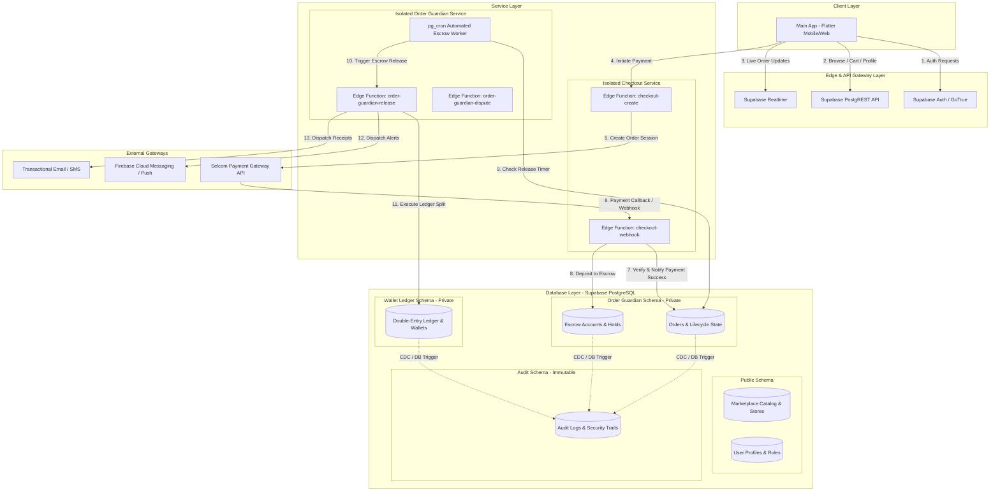
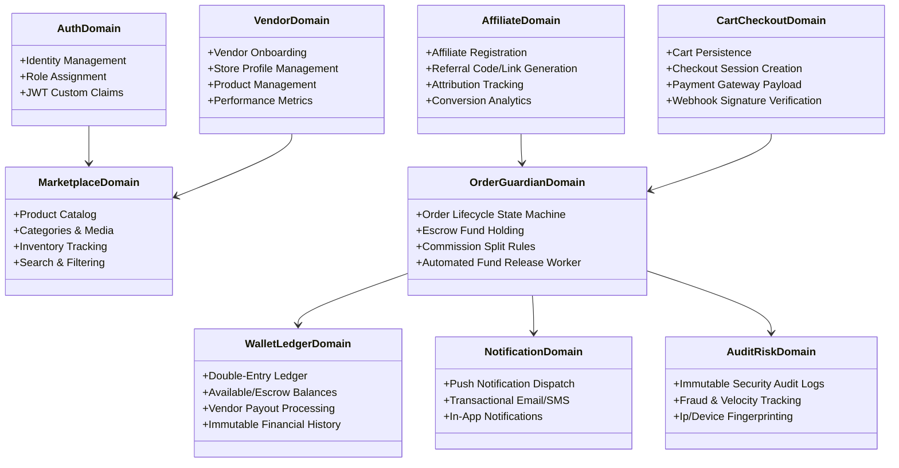
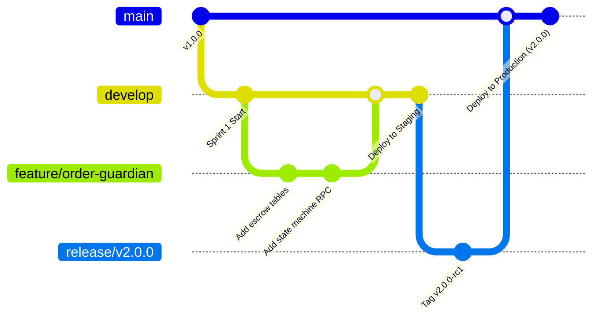
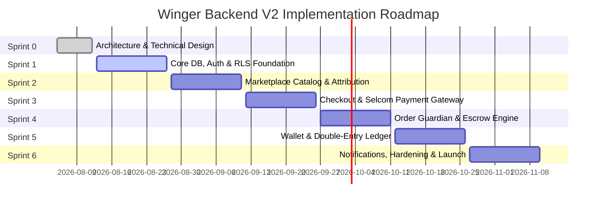

# Winger Backend V2 – Software Architecture Design (SAD)
**Document Version**: 2.0.0  
**Status**: Approved / Technical Specification  
**Author**: Lead Software Architect & Backend Engineering Team  
**Date**: August 2026  

---

## Executive Summary

Winger is a production-grade, high-volume social commerce marketplace connecting Customers, Vendors, and Affiliates. This document defines the backend architecture, security boundaries, domain boundaries, database design strategy, infrastructure organization, and development roadmap for **Winger Backend V2**.

To guarantee strict financial integrity, high reliability, and security compliance at scale, the architecture enforces a strict physical and logical separation between the **Main App**, the **Checkout System**, and **Order Guardian**.

---

## 1. Overall System Architecture

### 1.1 High-Level Architecture Diagram



### 1.2 System Component Boundaries & Responsibilities

| System Component | Scope & Responsibilities | Allowed Operations | Strict Prohibitions |
| :--- | :--- | :--- | :--- |
| **Main App** | User interface, catalog browsing, shopping cart management, user profile settings, order tracking, notifications display. | Query catalog, manage cart, view user orders, view own wallet balance, initiate checkout. | **NEVER** calculate commissions, mutate order states directly, access escrow accounts, or trigger payouts. |
| **Checkout System** | Isolated payment gateway integration layer. Creates payment sessions, handles Selcom webhooks/callbacks, verifies signatures. | Generate Selcom checkout payloads, verify HMAC signatures, record payment attempt events. | **NEVER** calculate affiliate/vendor splits, modify core marketplace state, or execute wallet ledger entries. |
| **Order Guardian** | The central financial and business logic engine. Manages order state machines, escrow funds, delivery confirmations, commission distribution, and vendor payouts. | Transition order lifecycle states, lock/release escrow funds, execute ledger double-entry transactions, trigger refunds. | **NEVER** expose public endpoints without internal service authentication; never bypass double-entry ledger rules. |
| **Supabase PostgreSQL** | Authoritative data store. Houses schemas for Public Catalog, Order Guardian, Financial Ledgers, and Security Audits. Enforces Row Level Security (RLS). | Execute ACID transactions, enforce RLS policies, execute internal stored procedures, log audit trails. | Direct client modifications to protected schemas (`order_guardian`, `wallet_ledger`, `audit_system`). |

### 1.3 Communication Protocol Architecture

1. **Synchronous REST / PostgREST (Client <-> Supabase)**: Used for standard catalog browsing, user profile queries, cart operations, and user dashboard views via standard Supabase Flutter SDK with JWT authorization.
2. **Synchronous HTTPS REST (Checkout <-> Selcom Gateway)**: HTTPS calls with API key authorization for session initialization, and HMAC-SHA256 signature verification for inbound payment webhooks.
3. **Asynchronous Database Triggers / CDC (Checkout -> Order Guardian)**: Upon successful payment verification by the Checkout webhook handler, a restricted RPC/Database Function updates the order state in `order_guardian.orders` and initializes escrow in `order_guardian.escrows`.
4. **Asynchronous Cron / Event-Driven Release (Order Guardian Escrow Engine)**: A PostgreSQL `pg_cron` scheduled worker continuously evaluates confirmed deliveries against auto-release time windows, executing escrow disbursements via atomic database functions.
5. **Realtime WebSocket Subscriptions (Supabase Realtime -> Main App)**: Mobile apps subscribe to Postgres Change Data Capture (CDC) events on specific user-scoped channels to update order status, delivery progress, and wallet balances instantaneously.

---

## 2. Domain Design (Bounded Contexts)



### Domain Specifications

#### 1. Auth & Identity Domain
- **Purpose**: Manage authentication lifecycle, user identity, and security roles.
- **Responsibilities**: Registration, login, multi-factor authentication (MFA), role claims injection (`user_role`: Customer, Vendor, Affiliate, Admin).
- **Ownership**: `auth` (Supabase managed) and `public.user_profiles`.
- **Dependencies**: None.

#### 2. Marketplace & Catalog Domain
- **Purpose**: Power product discovery and inventory management.
- **Responsibilities**: Product listing, categorization, variants, pricing, stock levels, product media attachments, search index sync.
- **Ownership**: `public.products`, `public.categories`, `public.product_variants`.
- **Dependencies**: Vendor Domain.

#### 3. Vendor Domain
- **Purpose**: Manage vendor business presence and store operations.
- **Responsibilities**: Vendor profiles, store settings, business verification documentation, store performance analytics.
- **Ownership**: `public.vendors`, `public.vendor_settings`.
- **Dependencies**: Auth Domain.

#### 4. Affiliate Domain
- **Purpose**: Facilitate affiliate marketing and attribution.
- **Responsibilities**: Referral link creation, tracking tokens, click attribution window (30-day cookie model), conversion mapping.
- **Ownership**: `public.affiliates`, `public.affiliate_links`, `public.attributions`.
- **Dependencies**: Auth Domain, Marketplace Domain.

#### 5. Cart & Checkout Domain
- **Purpose**: Handle customer selection and payment initialization.
- **Responsibilities**: Cart item management, price snapshots, Selcom checkout session creation, webhook payload verification.
- **Ownership**: `public.carts`, `checkout.sessions`, `checkout.payment_logs`.
- **Dependencies**: Marketplace Domain, Order Guardian Domain.

#### 6. Order Guardian Domain (Core Financial Engine)
- **Purpose**: Authoritative manager of order lifecycles, escrow accounts, and commission distribution rules.
- **Responsibilities**: Order state transitions (`PENDING_PAYMENT` -> `PAID_ESCROW` -> `SHIPPED` -> `DELIVERED` -> `RELEASED` / `DISPUTED`), commission calculation engine (Vendor share, Affiliate share, Platform fee), automated release timers.
- **Ownership**: `order_guardian.orders`, `order_guardian.escrows`, `order_guardian.disputes`.
- **Dependencies**: Cart Domain, Wallet Ledger Domain.

#### 7. Wallet & Double-Entry Ledger Domain
- **Purpose**: Provide a zero-variance, audit-compliant financial accounting system.
- **Responsibilities**: Double-entry journal entries, account balances (Available Balance, Pending Escrow Balance, Locked/Hold Balance), vendor payout queue, platform revenue accounting.
- **Ownership**: `wallet_ledger.accounts`, `wallet_ledger.journal_entries`, `wallet_ledger.ledger_lines`, `wallet_ledger.payouts`.
- **Dependencies**: Order Guardian Domain.

#### 8. Notifications & Communications Domain
- **Purpose**: Keep users informed across channels.
- **Responsibilities**: Push notifications via FCM, transactional SMS/email for order status changes, in-app notification center.
- **Ownership**: `public.notifications`, Edge Function dispatchers.
- **Dependencies**: Order Guardian Domain, User Domain.

#### 9. Audit, Risk & Anti-Fraud Domain
- **Purpose**: Ensure platform security, detect malicious activity, and provide legal auditability.
- **Responsibilities**: Capture immutable audit logs of all state changes, track payment velocity, flag suspicious multi-account affiliate behavior.
- **Ownership**: `audit_system.audit_logs`, `audit_system.risk_flags`.
- **Dependencies**: All Domains.

---

## 3. Database Strategy

### 3.1 Logical Schema Isolation

To maintain strict domain boundaries and security, the database is partitioned into four distinct schemas:

1. **`public`**: Accessible by frontend clients via Supabase PostgREST (guarded by RLS). Contains user profiles, marketplace catalog, store profiles, shopping carts, and public metadata.
2. **`order_guardian`**: Isolated schema for financial order management. **NOT** directly readable or writeable by standard frontend JWT tokens. Access is restricted strictly to Order Guardian Edge Functions and security-definer database RPCs.
3. **`wallet_ledger`**: Financial accounting schema enforcing double-entry rules. Contains ledger accounts, immutable entries, and payout records. Accessible only by Order Guardian Service Role.
4. **`audit_system`**: Append-only log store. Writeable strictly by system triggers. No update or delete operations allowed under any role.

### 3.2 Key Technical Strategies

- **UUID Strategy**: **UUIDv7** will be used for all primary keys across all schemas. UUIDv7 encodes a millisecond timestamp prefix, ensuring chronological sorting, eliminating B-tree index fragmentation, and vastly improving insertion performance compared to random UUIDv4.
- **Timestamp Strategy**: All time fields MUST use `TIMESTAMPTZ` (Timestamp with Time Zone) stored in UTC (`TIMEZONE('utc', NOW())`).
- **Soft Delete Strategy**: Tables supporting deletion must use `deleted_at TIMESTAMPTZ NULL`. All unique constraints must be partial indexes filtering out deleted rows (`WHERE deleted_at IS NULL`).
- **Optimistic Locking**: Critical state tables (`order_guardian.orders`, `wallet_ledger.accounts`, `public.product_variants`) MUST include a `version INTEGER NOT NULL DEFAULT 1` column. State modifications must enforce `WHERE id = :id AND version = :current_version` and increment `version = version + 1` to prevent race conditions under concurrent updates.
- **Auditing Trigger Strategy**: A generic PostgreSQL trigger (`fn_audit_record_change()`) will automatically serialize `OLD` and `NEW` tuple values into JSONB diffs, appending them to `audit_system.audit_logs` alongside the executing JWT user ID, client IP, and operation type.

---

## 4. Security Architecture

### 4.1 Authentication & Custom Claims

Authentication is handled by Supabase Auth (GoTrue). Upon user login, a custom database trigger enriches the issued JWT token with essential application metadata claims:

```json
{
  "sub": "018f2d5e-7a1b-7000-8000-123456789abc",
  "email": "vendor@winger.co",
  "app_metadata": {
    "user_role": "VENDOR",
    "vendor_id": "018f2d5e-9999-7000-8000-987654321xyz"
  }
}
```

### 4.2 Role Hierarchy

```
Super Admin (Platform Owner)
  ├── Finance Manager (Payout Approvals, Ledger Inspections)
  ├── Support Agent (Dispute Resolution, Customer Assistance)
  └── User Base
        ├── Vendor (Store Management, Product Operations)
        ├── Affiliate (Promotion, Attribution Tracking)
        └── Customer (Browsing, Ordering, Reviews)
```

### 4.3 Row Level Security (RLS) Principles

1. **Default Deny**: Every table created in any schema MUST immediately execute:
   ```sql
   ALTER TABLE <table_name> ENABLE ROW LEVEL SECURITY;
   ```
2. **Explicit Policies**: Access is granted exclusively through explicitly named policies following the format:  
   `<schema>_<table_name>_<role>_<action>_policy`  
   *Example*: `public_products_vendor_update_policy`.
3. **Isolation of Financial Tables**: Tables in `order_guardian` and `wallet_ledger` have **NO** RLS policies for `authenticated` or `anon` roles. They can only be accessed through database functions marked `SECURITY DEFINER` that perform internal validation of `auth.uid()` and `app_metadata.user_role`.

### 4.4 Secret Management & API Security

- **Secrets Storage**: All sensitive credentials (Selcom API keys, HMAC secret keys, webhook signing secrets, SMTP credentials) MUST be stored in Supabase Vault / Environment Variables (`supabase secrets set`).
- **Webhook Verification**: Inbound Selcom webhooks must be verified using HMAC-SHA256 signature verification in the Edge Function wrapper (`checkout-webhook`) before passing payloads to internal handlers. Webhook requests older than 300 seconds (5 minutes) based on request timestamp must be rejected to prevent replay attacks.
- **Rate Limiting**: Public API endpoints and Edge Functions enforce rate limits via Redis sliding-window algorithm (100 requests/minute for standard APIs; 5 requests/minute for checkout creation).

---

## 5. Repository Folder Structure

```
Winger/
├── .github/
│   └── workflows/
│       ├── ci-lint-test.yml          # Automated SQL linting & pgTAP testing
│       ├── cd-staging.yml            # Deployment to Staging Supabase Project
│       └── cd-production.yml         # Deployment to Production Supabase Project
├── docs/
│   ├── ARCHITECTURE.md               # Master Software Architecture Design (This file)
│   ├── database/
│   │   ├── ERD.md                    # Entity Relationship Diagrams
│   │   └── SCHEMAS.md                # Schema definitions & table specs
│   ├── order-guardian/
│   │   ├── STATE_MACHINE.md          # Order state transition rules
│   │   └── ESCROW_RULES.md           # Escrow release and dispute policies
│   ├── checkout/
│   │   └── SELCOM_INTEGRATION.md     # Selcom API payload and callback specs
│   ├── wallet/
│   │   └── DOUBLE_ENTRY_LEDGER.md    # Ledger account structures & rules
│   ├── security/
│   │   └── RLS_MATRIX.md             # Security role permission matrix
│   └── adr/
│       ├── 0001-modular-monolith.md  # ADR: Architecture choice
│       ├── 0002-uuidv7-keys.md       # ADR: Primary key selection
│       └── 0003-double-entry.md      # ADR: Financial ledger design
├── supabase/
│   ├── config.toml                   # Supabase CLI project configuration
│   ├── seed.sql                      # Local development test dataset
│   ├── migrations/                   # Chronological SQL migration files
│   │   ├── 20260805000001_init_schemas.sql
│   │   ├── 20260805000002_create_public_tables.sql
│   │   ├── 20260805000003_create_order_guardian_tables.sql
│   │   ├── 20260805000004_create_wallet_ledger_tables.sql
│   │   ├── 20260805000005_create_audit_tables.sql
│   │   └── 20260805000006_apply_rls_policies.sql
│   ├── functions/                    # Supabase Edge Functions (Deno / TypeScript)
│   │   ├── _shared/                  # Shared helper modules
│   │   │   ├── db-client.ts          # Authenticated Supabase client
│   │   │   ├── hmac-verify.ts        # Webhook signature verifier
│   │   │   ├── response-builder.ts   # Standardized JSON response handler
│   │   │   └── types.ts              # Global TypeScript interfaces
│   │   ├── checkout-create/          # Creates payment session with Selcom
│   │   ├── checkout-webhook/         # Processes Selcom payment callbacks
│   │   ├── order-guardian-release/   # Executes escrow release logic
│   │   ├── order-guardian-dispute/   # Handles buyer/vendor dispute flows
│   │   └── notification-dispatch/    # Sends push/SMS/email notifications
│   └── tests/                        # Automated database & policy tests
│       ├── database/
│       │   ├── 01_rls_public_test.sql
│       │   ├── 02_order_guardian_test.sql
│       │   └── 03_wallet_ledger_test.sql
│       └── functions/
│           └── checkout_test.ts
├── scripts/
│   ├── dev-setup.sh                  # One-command developer bootstrap script
│   └── db-reset.sh                   # Resets local Supabase DB with seed data
└── README.md                         # Project developer onboarding guide
```

---

## 6. Coding Standards & Conventions

### 6.1 Database & SQL Conventions
- **Keywords**: SQL keywords MUST be in UPPERCASE (`SELECT`, `INSERT`, `UPDATE`, `WHERE`, `JOIN`).
- **Identifiers**: Identifiers MUST use `snake_case` in lowercase (e.g., `user_profiles`, `created_at`).
- **Table Names**: Tables MUST use plural nouns (e.g., `orders`, `products`, `vendors`).
- **Primary Keys**: Primary key columns MUST be named `id` (type `UUID`).
- **Foreign Keys**: Foreign key columns MUST use `<singular_table>_id` (e.g., `vendor_id`, `order_id`).
- **Functions**: Stored procedures/RPCs MUST follow the pattern `fn_<schema>_<action_description>()` (e.g., `fn_order_guardian_release_escrow()`).
- **Enums**: Enum type definitions MUST use `enum_<domain>_<name>` (e.g., `enum_order_status`).

### 6.2 Edge Function & API Conventions
- **Folder/URL Names**: Endpoint paths MUST use `kebab-case` (e.g., `/checkout-create`, `/notification-dispatch`).
- **Variables & Code**: TypeScript code MUST follow standard `camelCase` for variables and `PascalCase` for classes/interfaces.
- **HTTP Response Structure**: All Edge Functions MUST return a standard JSON envelope:
  ```json
  {
    "success": true,
    "code": "PAYMENT_SESSION_CREATED",
    "data": { "checkout_url": "https://..." },
    "error": null,
    "timestamp": "2026-08-05T08:24:35Z"
  }
  ```

### 6.3 Migration File Conventions
Migration files MUST follow strict timestamped formatting:  
`YYYYMMDDHHMMSS_<short_description>.sql`  
*Example*: `20260805143000_add_affiliate_attribution_window.sql`

### 6.4 Git Commit Conventions
Follow the **Conventional Commits** specification:
- `feat(order-guardian)`: New state transition logic.
- `fix(checkout)`: Correct Selcom payload encoding.
- `docs(architecture)`: Update domain diagram.
- `test(rls)`: Add pgTAP policy validation.

---

## 7. Development & Deployment Workflow



### 7.1 Local Development Environment Setup
1. Developers run `supabase start` using Supabase CLI to spin up local PostgreSQL, Auth, Storage, and Realtime instances in Docker.
2. Local database schema is hydrated by running `supabase migration up` followed by `supabase db reset` (which applies `seed.sql`).
3. Local Edge Functions run via `supabase functions serve`.

### 7.2 Migration Workflow
1. Schema changes are crafted in new migration files inside `supabase/migrations/`.
2. Changes are validated locally using `supabase db diff` to check for unintended side effects.
3. Automated pgTAP unit tests run against local DB via `supabase test db`.
4. Migration is committed to Git feature branch.

### 7.3 CI/CD & Deployment Pipeline
- **Pull Request**: GitHub Actions runs `ci-lint-test.yml` (validates SQL syntax, lints TypeScript Edge Functions, executes pgTAP test suite).
- **Merge to `develop`**: Triggers `cd-staging.yml`, applying migrations to the Staging environment using `supabase db push --workdir .` and deploying Edge Functions.
- **Merge to `main`**: Triggers `cd-production.yml`. Prompts for manual approval from Lead Architect before pushing migrations to Production.

### 7.4 Rollback Strategy
- **Database Migrations**: Every migration script MUST have an accompanying down-migration script documented in `/docs/database/rollbacks/`. In the event of a deployment failure, Point-In-Time Recovery (PITR) allows database restoration to any second prior to the migration.
- **Edge Functions**: Edge Functions are versioned. Rolling back requires running `supabase functions deploy <function-name> --version <previous_version>`.

---

## 8. Documentation Hierarchy (`/docs`)

| Document Path | Content Description | Target Audience |
| :--- | :--- | :--- |
| `/docs/ARCHITECTURE.md` | Master System Architecture Design document (This document). | All Engineers, Architects, CTO |
| `/docs/database/SCHEMAS.md` | Comprehensive catalog of schemas, tables, indexes, and column constraints. | Backend Engineers, DBAs |
| `/docs/order-guardian/STATE_MACHINE.md` | Formal order lifecycle state machine specification & transition triggers. | Backend Engineers, QA |
| `/docs/order-guardian/ESCROW_RULES.md` | Rules for escrow lockup, dispute holds, auto-release timers, and refunds. | Finance Team, Backend Engineers |
| `/docs/checkout/SELCOM_INTEGRATION.md` | Selcom API endpoints, request/response formats, signature algorithms, and webhooks. | Backend Engineers, Security Auditors |
| `/docs/wallet/DOUBLE_ENTRY_LEDGER.md` | Chart of accounts, debit/credit journal rules, and payout processing pipelines. | Accountants, Backend Engineers |
| `/docs/security/RLS_MATRIX.md` | Role permission matrix mapping roles to table operations and RLS policies. | Security Engineers, Backend Engineers |
| `/docs/deployment/CICD_RUNBOOK.md` | Guide to CI/CD pipelines, environment configurations, and release procedures. | DevOps / SRE |
| `/docs/adr/0001-...` | Architecture Decision Records capturing context, options, and rationale. | Lead Architect, Future Engineers |

---

## 9. Implementation Sprint Roadmap



### Detailed Sprint Breakdown

#### Sprint 1: Core Database Foundation, Auth & RLS
- **Goal**: Establish core PostgreSQL schemas, Supabase Auth integration, and security base.
- **Deliverables**: Initial SQL migrations (`public`, `order_guardian`, `wallet_ledger`, `audit_system`), custom claims JWT trigger, base RLS policies, local development bootstrap scripts.
- **Dependencies**: Sprint 0 design approval.
- **Acceptance Criteria**: 100% of tables have RLS enabled; Auth triggers successfully inject `user_role` claims; pgTAP test suite passes basic security checks.

#### Sprint 2: Marketplace Catalog, Vendor Stores & Affiliate Attribution
- **Goal**: Implement public marketplace functionality and affiliate tracking engine.
- **Deliverables**: Products, Categories, Variants, Vendor Store profiles, Cart management tables/RPCs, Affiliate link generation & cookie attribution engine.
- **Dependencies**: Sprint 1 completion.
- **Acceptance Criteria**: Vendors can create and manage catalog items; Customers can manage carts; Affiliate link clicks correctly set 30-day attribution records.

#### Sprint 3: Checkout System & Selcom Integration
- **Goal**: Build isolated payment gateway service.
- **Deliverables**: `checkout-create` Edge Function, `checkout-webhook` Edge Function, Selcom HMAC-SHA256 signature verifier, payment session logging.
- **Dependencies**: Sprint 2 completion.
- **Acceptance Criteria**: Checkout sessions generate valid Selcom payment URLs; inbound webhooks are signature-verified and idempotent.

#### Sprint 4: Order Guardian Engine & Escrow System
- **Goal**: Implement the core financial state machine and escrow automation.
- **Deliverables**: Order lifecycle state machine RPCs, Escrow table schemas, dispute hold procedures, `pg_cron` automated escrow release worker.
- **Dependencies**: Sprint 3 completion.
- **Acceptance Criteria**: Orders correctly transition through states; funds are locked in escrow upon payment verification; auto-release worker releases funds after delivery timeout.

#### Sprint 5: Wallet Engine & Double-Entry Ledger System
- **Goal**: Build immutable financial accounting and vendor payout engine.
- **Deliverables**: Chart of accounts, journal entries schema, ledger lines triggers, vendor payout request queue, platform revenue fee calculation RPCs.
- **Dependencies**: Sprint 4 completion.
- **Acceptance Criteria**: Zero-variance debit/credit balancing verified across all transactions; double-entry rules strictly enforced; payouts process without balance leaks.

#### Sprint 6: Realtime Notifications, Fraud Detection, Hardening & Launch Readiness
- **Goal**: Finalize external integrations, security auditing, performance tuning, and launch preparation.
- **Deliverables**: FCM push notification Edge Function, anti-fraud velocity triggers, load testing scripts, end-to-end integration tests, final security audit.
- **Dependencies**: Sprints 1–5.
- **Acceptance Criteria**: End-to-end purchase flow completes successfully under simulated load (1,000 concurrent transactions); security audit identifies zero high-severity vulnerabilities.

---

## 10. Technical Risk Matrix & Mitigation Strategies

| Risk Category | Identified Technical Risk | Severity / Impact | Mitigation Strategy |
| :--- | :--- | :--- | :--- |
| **Financial / Concurrency** | Race conditions during simultaneous escrow release or balance withdrawal requests causing negative balances. | **CRITICAL** | Enforce strict optimistic locking (`version` column) and PostgreSQL row-level locks (`SELECT FOR UPDATE`). All ledger entries must execute within atomic double-entry database transactions. |
| **Security / Webhooks** | Duplicate or forged payment webhooks from malicious third parties resulting in unauthorized order fulfillment. | **HIGH** | Enforce mandatory HMAC-SHA256 signature verification on all incoming Selcom webhooks. Store processed transaction IDs with `UNIQUE` constraints to enforce strict idempotency. |
| **Security / RLS** | Misconfigured Row Level Security policy exposing private vendor or order data to unauthorized clients. | **HIGH** | Maintain default-deny policy. Enforce automated pgTAP testing in CI/CD pipeline that explicitly tests every table against `anon`, `customer`, `vendor`, and `affiliate` roles before deployment. |
| **Performance / Scaling** | High database index fragmentation and B-tree bloat due to high-volume insert operations on primary keys. | **MEDIUM** | Use **UUIDv7** for all primary keys across all schemas. UUIDv7 provides natural time-locality sorting, keeping index updates localized to the rightmost B-tree pages. |
| **Operational / Edge Functions** | Edge Function timeouts or cold-start delays impacting user checkout experience during peak marketing events. | **MEDIUM** | Keep Edge Functions lightweight by offloading heavy background computations (such as email sending and ledger reconciliations) to asynchronous background workers (`pg_cron` and queue tables). |

---

## 11. Industry Best Practices & Guidelines

### 11.1 Supabase & PostgreSQL Performance & Safety
1. **Connection Pooling**: Use Supabase Supavisor connection pooler for all Edge Function database connections to prevent pool exhaustion under high concurrency.
2. **Indexing Guidelines**: Create explicit foreign key indexes on all child tables. Create partial indexes for soft-deleted queries (`WHERE deleted_at IS NULL`).
3. **Transaction Isolation**: Financial RPCs in Order Guardian and Wallet domains must explicitly set isolation levels (`SET TRANSACTION ISOLATION LEVEL SERIALIZABLE`) where strict serializability is required.

### 11.2 Double-Entry Ledger Principles
1. **Immutable Records**: The `wallet_ledger.ledger_lines` table is **INSERT-ONLY**. `UPDATE` and `DELETE` commands are explicitly revoked for all roles.
2. **Balancing Constraint**: Every journal entry MUST consist of at least two ledger lines where:
   $$\sum \text{Debits} = \sum \text{Credits}$$
   A database trigger will reject any transaction where the sum of debits does not equal credits.

### 11.3 Flutter Integration Guidelines
1. **Type-Safe Data Models**: Generate strongly typed Dart DTO models matching the Supabase database schema using `supabase_codegen`.
2. **State Management**: Use reactive Supabase Realtime streams for order status tracking, bound directly to Flutter UI state management (e.g., Riverpod or Bloc).

---

**[END OF ARCHITECTURE SPECIFICATION]**
