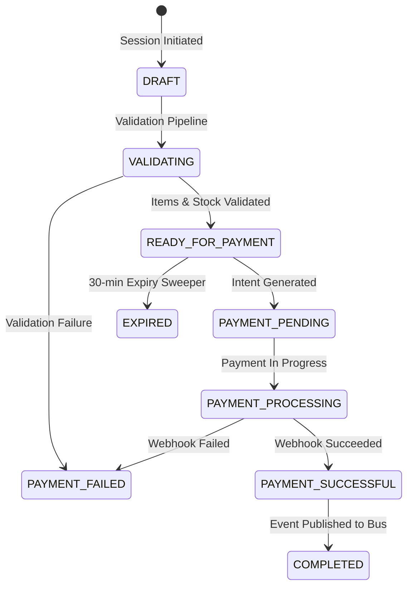

# Winger Backend V2 – Checkout State Machine Specification

Defines the formal state transitions for checkout purchasing sessions.

---

## 1. Checkout State Machine Diagram

---

## 2. Permitted Transitions
`DRAFT` $\rightarrow$ `VALIDATING` $\rightarrow$ `READY_FOR_PAYMENT` $\rightarrow$ `PAYMENT_PENDING` $\rightarrow$ `PAYMENT_PROCESSING` $\rightarrow$ `PAYMENT_SUCCESSFUL` $\rightarrow$ `COMPLETED`.
