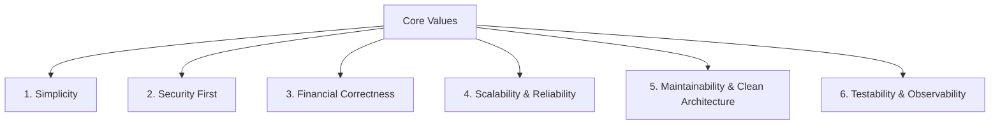
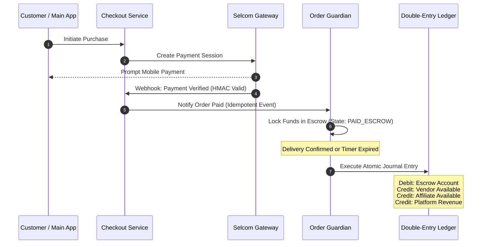
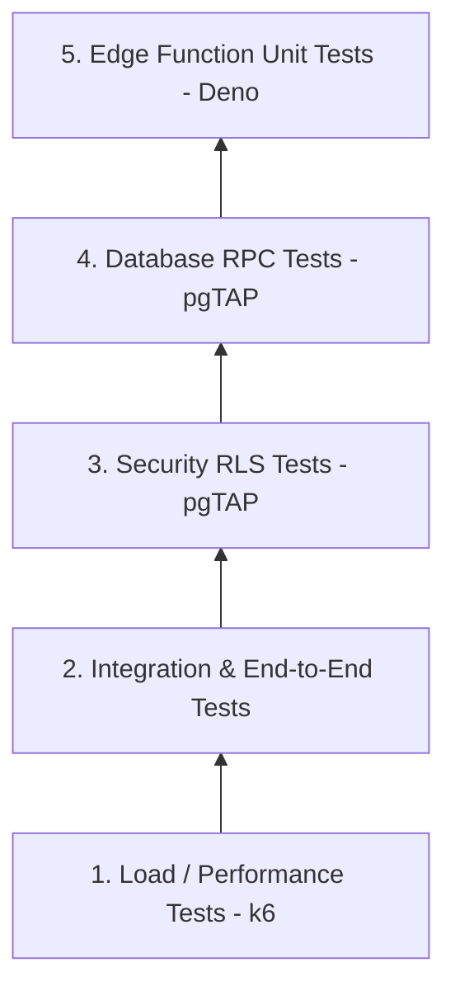

# Winger Backend V2 – Engineering Principles Handbook

**Document Title**: Winger Backend Platform Constitution  
**Document Version**: 2.0.0  
**Status**: Authoritative & Mandatory  
**Author**: Principal Software Architect & Backend Engineering Leadership  
**Target Audience**: All Backend Engineers, DevOps, System Architects, and Code Reviewers  

---

## Preamble

Winger is a production-grade, high-scale social commerce marketplace connecting Customers, Vendors, and Affiliates. The platform handles real monetary transactions, vendor balance distributions, affiliate commissions, and automated escrow holdings.

In a system that processes real financial value, software bugs are not minor inconveniences—they represent financial loss, legal liability, and breach of user trust. Therefore, engineering at Winger is governed by strict discipline.

This handbook defines the **Engineering Constitution** of Winger. Every future architecture decision, database migration, Edge Function, API endpoint, database query, and pull request MUST strictly adhere to these principles.

---

## 1. Engineering Vision

The long-term engineering vision for Winger is to operate a **zero-variance, ultra-secure, horizontally scalable marketplace platform** capable of supporting millions of daily transactions with institutional-grade financial correctness.

We build for longevity. We prioritize system predictability and formal boundary separation over hasty feature delivery. Winger’s architecture assumes that every component will eventually process millions of requests under adverse conditions (network failures, malicious attacks, concurrent race conditions).

Our goal is an infrastructure where:
- Financial balances can be audited down to the cent at any millisecond.
- Security breaches are rendered impossible by structural architecture rather than superficial runtime checks.
- New engineers can reason about domain boundaries without holding the entire codebase in memory.

---

## 2. Core Engineering Values



### 2.1 Simplicity
- **Definition**: Write clear, linear, self-explanatory code. Avoid premature abstractions, complex metaprogramming, or obscure frameworks.
- **Why It Exists**: Clever code is difficult to review, maintain, and debug. Simple code fails predictably and is easy to audit.
- **Practical Rule**: If a complex design pattern can be replaced with a straightforward linear function without compromising performance or security, choose the simpler implementation.

### 2.2 Security First
- **Definition**: Treat every external input, network packet, and API request as untrusted and potentially malicious.
- **Why It Exists**: Security cannot be retrofitted onto an existing system; it must be designed into the foundational layer.
- **Practical Rule**: Enforce defense-in-depth. Security controls MUST exist at the database level (Row Level Security), API gateway layer (Rate Limiting & Authentication), and function level (Validation & HMAC Signatures).

### 2.3 Financial Correctness
- **Definition**: Zero tolerance for variance, balance drift, missing audit records, or race conditions in monetary operations.
- **Why It Exists**: Financial errors erode vendor trust, create accounting discrepancies, and lead to direct business loss.
- **Practical Rule**: Financial correctness ALWAYS supersedes developer convenience or raw execution speed.

### 2.4 Scalability & Reliability
- **Definition**: Systems must be designed stateless at the application layer and index-optimized at the storage layer to handle exponential traffic growth without degradation.
- **Why It Exists**: Marketing campaigns and viral affiliate drives create sudden $10\times$ traffic spikes.
- **Practical Rule**: Never write queries that require full table scans; never rely on local state inside Edge Functions.

### 2.5 Maintainability & Clean Architecture
- **Definition**: Strict separation of concerns between bounded contexts. Main App, Order Guardian, and Checkout System MUST remain strictly decoupled.
- **Why It Exists**: Tight coupling creates cascade failures where a minor marketplace bug degrades payment processing or financial escrow release.
- **Practical Rule**: The Main App must never contain payment logic; Checkout must never calculate commission splits; Order Guardian must never execute arbitrary client mutations.

### 2.6 Testability & Observability
- **Definition**: Every feature must be verifiably correct via automated tests, and every system action must emit structured telemetry.
- **Why It Exists**: Un-tested financial logic will fail in production; un-observable systems cannot be debugged when edge cases occur.
- **Practical Rule**: No pull request may be merged without accompanying unit/integration tests and structured log instrumentation.

---

## 3. Database Principles

### 3.1 Primary Keys: UUIDv7 Enforcement
- **Principle**: All primary keys across all PostgreSQL schemas MUST use **UUIDv7**.
- **Why**: Standard random UUIDv4 causes extreme B-tree index fragmentation under heavy write loads because insertions occur at random locations. UUIDv7 embeds a millisecond-timestamp prefix, making keys chronologically sortable and ensuring insertions occur at the rightmost B-tree leaf page.
- **Example**:
  ```sql
  -- Correct UUIDv7 primary key definition
  CREATE TABLE public.products (
      id UUID PRIMARY KEY DEFAULT gen_random_uuid_v7(),
      name TEXT NOT NULL
  );
  ```

### 3.2 Immutable Financial Records
- **Principle**: Financial ledger tables (`wallet_ledger.ledger_lines`, `audit_system.audit_logs`) are **INSERT-ONLY**. `UPDATE` and `DELETE` commands are explicitly revoked for all roles, including service roles.
- **Why**: Financial history must be immutable for legal compliance and auditability. Accounting errors are corrected by creating new compensating journal entries, never by mutating or deleting past records.

### 3.3 Soft Delete Pattern
- **Principle**: Entities subject to user deletion (products, user profiles, store listings) must use soft deletes via `deleted_at TIMESTAMPTZ NULL`.
- **Why**: Hard deletes break historical foreign key relationships, distort historical analytics, and prevent accidental data recovery.
- **Practical Rule**: All unique constraints on soft-deletable tables MUST use partial indexes:
  ```sql
  CREATE UNIQUE INDEX idx_unique_vendor_product_sku 
  ON public.products (vendor_id, sku) 
  WHERE deleted_at IS NULL;
  ```

### 3.4 Automated Audit Trails
- **Principle**: Critical entity changes MUST trigger an automated change-data-capture (CDC) trigger that logs JSON diffs (`OLD` vs `NEW`) to `audit_system.audit_logs`.
- **Why**: Provides an indisputable security trail showing WHO changed WHAT, WHEN, and FROM WHERE.

### 3.5 Timestamp Standards
- **Principle**: Every table must contain `created_at` and `updated_at` columns of type `TIMESTAMPTZ` (Timestamp with Time Zone). All times must be evaluated and stored in **UTC**.
- **Why**: Avoids subtle daylight savings bugs, time-zone offset miscalculations, and multi-region deployment discrepancies.
- **Syntax**: `created_at TIMESTAMPTZ NOT NULL DEFAULT TIMEZONE('utc', NOW())`.

### 3.6 Database Normalization & JSONB Rules
- **Principle**: Database schemas must strictly follow Third Normal Form (3NF). Use `JSONB` ONLY for unstructured third-party payloads, system configuration objects, or audit diff snapshots.
- **Why**: Overusing JSONB columns for core relational domain properties destroys type safety, prevents foreign key enforcement, and makes indexing difficult.

### 3.7 Database Naming Standards
- Schema names: Lowercase singular (`public`, `order_guardian`, `wallet_ledger`, `audit_system`).
- Table names: Lowercase plural `snake_case` (`user_profiles`, `orders`, `escrows`).
- Column names: Lowercase singular `snake_case` (`vendor_id`, `created_at`).
- Foreign Keys: `<singular_target_table>_id` (e.g., `product_id`).
- Stored Procedures: `fn_<schema>_<action_description>()` (e.g., `fn_order_guardian_release_escrow()`).
- Enums: `enum_<domain>_<name>` (e.g., `enum_order_status`).

### 3.8 Database Migration Rules
- Every schema modification must be executed through a timestamped migration file in `supabase/migrations/YYYYMMDDHHMMSS_<description>.sql`.
- Direct manual modifications to Staging or Production databases are strictly forbidden.
- Every migration script MUST be idempotent and backwards-compatible with active application code.

---

## 4. Financial Principles



### 4.1 Strict Double-Entry Accounting
- **Principle**: Every monetary movement in Winger MUST be recorded as a balanced double-entry transaction consisting of equal Debits and Credits:
  $$\sum \text{Debits} = \sum \text{Credits}$$
- **Why**: Single-column balance updating (`UPDATE wallets SET balance = balance + 10`) is vulnerable to race conditions, lost updates, and balance drift. Double-entry accounting guarantees that every cent is accounted for across asset, liability, revenue, and escrow accounts.

### 4.2 Prohibited Direct Wallet Updates
- **Principle**: No database query, API, or Edge Function is permitted to execute `UPDATE wallet SET balance = ...`.
- **Why**: Direct balance mutations bypass financial auditing and lead to un-trackable balance discrepancies.
- **Rule**: Account balances are derived or updated strictly through database triggers that process verified `wallet_ledger.journal_entries`.

### 4.3 Mandatory Escrow-First Model
- **Principle**: All customer funds received from Checkout MUST immediately enter an **Escrow Account** managed exclusively by Order Guardian.
- **Why**: Protects customers against unfulfilled orders and protects vendors against fraudulent chargebacks before delivery confirmation.
- **Rule**: Funds remain locked in escrow until (a) customer confirms delivery, (b) logistics delivery confirmation event arrives, or (c) auto-release timer expires without a dispute.

### 4.4 Financial Idempotency
- **Principle**: Every financial API, webhook, and stored procedure MUST accept and enforce a unique `idempotency_key`.
- **Why**: Network timeouts cause clients or webhooks to retry requests. Without idempotency, a retried request could result in double payouts, double escrow releases, or duplicate charges.
- **Rule**: Processing an idempotency key that has already succeeded MUST return the original cached response without re-executing the financial transaction.

### 4.5 Atomic Transactions & Isolation Levels
- **Principle**: All state transitions that alter financial balances MUST execute within a single atomic database transaction.
- **Why**: Partial failures (e.g., escrow releasing successfully but vendor balance credit failing) cause severe accounting errors.
- **Rule**: Financial transactions must use PostgreSQL explicit row locking (`SELECT FOR UPDATE`) or `SERIALIZABLE` isolation levels to eliminate race conditions under concurrent requests.

---

## 5. Security Principles

### 5.1 Authentication (AuthN)
- Authentication is governed by Supabase Auth (GoTrue).
- Client requests must include a valid Bearer JWT.
- JWT tokens are enriched with custom claims (`user_role`, `vendor_id`) by a security-definer database trigger on login.

### 5.2 Authorization (AuthZ) & RLS
- **Default Deny**: `ALTER TABLE <table_name> ENABLE ROW LEVEL SECURITY;` is mandatory for 100% of database tables upon creation.
- **Public Schema RLS**: Access to `public` tables is governed by strict RLS policies using `auth.uid()` and custom JWT claims.
- **Private Schema Isolation**: Tables in `order_guardian`, `wallet_ledger`, and `audit_system` MUST NOT have public RLS policies. They are completely inaccessible to frontend clients (`anon` and `authenticated` roles).

### 5.3 Service Role Boundaries
- The Supabase `service_role` key bypasses all RLS.
- **Rule**: The `service_role` key MUST NEVER be embedded in mobile/web client builds.
- **Rule**: Edge Functions must limit their use of `service_role` strictly to internal Order Guardian and Checkout execution paths.

### 5.4 Secret Management
- Zero hardcoded secrets in source code, configuration files, or client bundles.
- All secrets (Selcom keys, HMAC signing keys, FCM credentials) must be stored in Supabase Vault / Environment Secrets (`supabase secrets set`).

### 5.5 Webhook Signature Verification
- Inbound webhooks from third-party services (Selcom) MUST be validated in the Edge Function entry point using HMAC-SHA256 signature algorithms.
- Payload body and HTTP timestamp headers MUST be checked. Webhooks with timestamps older than 300 seconds (5 minutes) MUST be rejected to prevent replay attacks.

### 5.6 API Rate Limiting
- Public-facing APIs and Edge Functions MUST enforce rate limits at the API Gateway / Edge layer using sliding-window algorithms.
- **Limits**:
  - General Read APIs: 100 requests / minute per IP.
  - Cart / Checkout Creation: 5 requests / minute per User ID.
  - Webhook Endpoints: 500 requests / minute per verified Gateway IP.

---

## 6. API Design Principles

### 6.1 RESTful Naming & HTTP Verbs
- API paths MUST use lower-case plural nouns representing resources (`/v1/orders`, `/v1/products`).
- Standard verbs:
  - `GET`: Retrieve resource(s). Must be idempotent and side-effect free.
  - `POST`: Create resource or execute RPC action.
  - `PATCH`: Partial update of a resource.
  - `DELETE`: Soft delete a resource.

### 6.2 Standard Response Envelope
All Edge Functions and custom API endpoints MUST return a uniform JSON response structure:

```json
{
  "success": true,
  "code": "ORDER_RELEASED_SUCCESS",
  "message": "Order escrow successfully released to vendor and affiliate accounts.",
  "data": {
    "order_id": "018f2d5e-7a1b-7000-8000-123456789abc",
    "status": "RELEASED"
  },
  "error": null,
  "timestamp": "2026-08-05T08:29:42Z"
}
```

### 6.3 Standardized Error Envelope
When an error occurs, HTTP status code must accurately reflect the failure type (`400 Bad Request`, `401 Unauthorized`, `403 Forbidden`, `409 Conflict`, `422 Unprocessable Entity`, `500 Internal Error`):

```json
{
  "success": false,
  "code": "INVALID_IDEMPOTENCY_KEY",
  "message": "The provided idempotency key has already been used with a different request payload.",
  "data": null,
  "error": {
    "field": "idempotency_key",
    "details": "Payload hash mismatch."
  },
  "timestamp": "2026-08-05T08:29:42Z"
}
```

### 6.4 Input Validation
- Every Edge Function MUST validate request payloads against strict Zod schemas before initiating any business or database logic.
- Un-validated payload properties must be stripped immediately.

### 6.5 Cursor-Based Pagination
- APIs returning lists of items MUST enforce pagination.
- **Rule**: Cursor-based pagination (`limit`, `after_id`) MUST be used for high-volume endpoints (feed, orders, transactions). Traditional offset pagination (`OFFSET 1000`) is prohibited due to high PostgreSQL memory scan overhead at scale.

---

## 7. Edge Function Principles

### 7.1 When to Use Edge Functions
Use Edge Functions strictly for:
1. Receiving and verifying external webhooks (Selcom payment callbacks).
2. Interfacing with third-party HTTPS APIs (Selcom session creation, FCM push notifications, SMS/Email dispatchers).
3. Complex multi-step orchestrations spanning multiple external services.

### 7.2 When NOT to Use Edge Functions
Do NOT use Edge Functions for:
1. Standard CRUD operations on database tables (Use PostgREST directly with RLS).
2. Complex pure database transactions (Use PostgreSQL security-definer stored procedures for maximum speed and atomic safety).

### 7.3 Execution Limits & Timeout Strategy
- Synchronous client-facing Edge Functions MUST execute within **500ms** (hard timeout at 10,000ms).
- Long-running asynchronous background jobs (e.g., generating monthly vendor tax statements) MUST NOT run in client Edge Functions; offload them to database queue tables processed asynchronously by `pg_cron` workers.

---

## 8. Event & Messaging Principles

### 8.1 Event Emission Triggers
Events must be emitted when significant domain state transitions occur (`order.created`, `payment.verified`, `escrow.locked`, `escrow.released`, `dispute.raised`).

### 8.2 Event Naming Specification
Event topic names MUST strictly follow the pattern:  
`<bounded_context>.<entity>.<past_tense_verb>`  
*Examples*:
- `order_guardian.order.payment_verified`
- `order_guardian.escrow.released`
- `affiliate.attribution.converted`

### 8.3 Retry Policies & Poison Message Dead-Letter Queue
- Event subscribers must implement exponential backoff with jitter (initial delay: 1s; max delay: 60s; max retries: 5).
- If an event fails processing after 5 retries, it MUST be moved to `audit_system.dead_letter_queue` with error details, and an urgent alert must be dispatched to backend engineering.

---

## 9. Code Quality & Review Standards

### 9.1 Self-Documenting Code & Comments
- Code must be written so that its intent is obvious without requiring excessive comments.
- **Compulsory Comments**: Comments are mandatory for (a) explaining non-obvious business domain rules, (b) describing complex SQL join strategies, or (c) clarifying financial formula decisions.

### 9.2 SQL Formatting Guidelines
- SQL keywords MUST be in **UPPERCASE** (`SELECT`, `INSERT`, `UPDATE`, `JOIN`, `WHERE`).
- Always explicitly list column names in SELECT statements (`SELECT id, name FROM...`). `SELECT *` is strictly forbidden in application code.

### 9.3 Pull Request & Code Review Requirements
- Every PR requires at least **two senior backend engineer approvals** before merging to `develop` or `main`.
- PRs containing database schema migrations or security RLS changes require explicit approval from the Lead Software Architect.
- All automated CI checks (SQL linting, pgTAP database tests, Edge Function unit tests) MUST pass 100%.

---

## 10. Testing Principles



### 10.1 Testing Pyramid
1. **Edge Function Unit Tests**: Test payload validation, HMAC verifiers, and response builders in isolation using Deno test harness.
2. **Database & RLS Tests (`pgTAP`)**: Execute automated SQL assertions inside Postgres. Validate that RLS blocks unauthorized reads/writes for every user role (`anon`, `customer`, `vendor`, `affiliate`).
3. **Integration Tests**: Test full end-to-end flows (`Checkout -> Webhook -> Order Guardian Escrow -> Auto Release -> Wallet Ledger`).
4. **Load & Stress Tests**: Validate system response times and database connection limits under 1,000 requests/second using `k6` scripts.

---

## 11. Performance & Optimization Principles

### 11.1 Indexing Guidelines
- Every foreign key column MUST have a corresponding B-tree index to prevent full table scans during JOIN operations.
- Use partial indexes for soft-deleted tables (`WHERE deleted_at IS NULL`).
- Over-indexing slows down `INSERT`/`UPDATE` operations. Unused indexes must be pruned based on `pg_stat_user_indexes`.

### 11.2 Prevention of N+1 Queries
- Frontend and backend code MUST NOT execute queries inside loops.
- Use Supabase PostgREST nested resource embedding (`products?select=*,vendor:vendors(*)`) or SQL array aggregations (`JSON_AGG`) to fetch relational hierarchies in a single database round-trip.

### 11.3 Connection Pooling Strategy
- All Edge Functions connecting directly to PostgreSQL MUST route through the **Supabase Supavisor Connection Pooler** (Transaction Mode) to prevent connection starvation.

---

## 12. Observability & Monitoring Principles

### 12.1 Structured Logging Standards
All application logs MUST be emitted as single-line JSON objects containing standard contextual metadata:

```json
{
  "timestamp": "2026-08-05T08:29:42Z",
  "level": "INFO",
  "environment": "production",
  "service": "order-guardian-release",
  "correlation_id": "corr_018f2d5e-9999",
  "user_id": "018f2d5e-7a1b",
  "event": "ESCROW_RELEASE_EXECUTION",
  "details": {
    "order_id": "018f2d5e-1111",
    "vendor_amount": 8500,
    "affiliate_amount": 1000,
    "platform_fee": 500
  }
}
```

### 12.2 Alerting Thresholds
Immediate PagerDuty / Slack alerts are triggered when:
- Webhook signature verification fails more than 5 times in 1 minute (Potential attack).
- Any unhandled exception occurs in Order Guardian or Wallet Ledger RPCs.
- Database connection pool utilization exceeds 85% for more than 2 minutes.

---

## 13. Operational & Disaster Recovery Principles

### 13.1 Database Backups & Point-In-Time Recovery (PITR)
- Automated physical backups are taken daily.
- Point-In-Time Recovery (PITR) is enabled on Production, allowing the database to be restored to any exact second within the last 30 days.

### 13.2 Zero-Downtime Migration Deployments
- Migrations MUST be additive and backward-compatible.
- Renaming or deleting columns is executed in a two-phase deployment:
  - **Phase 1**: Add new column, update application code to write to both old and new columns.
  - **Phase 2**: Backfill historical data, update code to read from new column, drop old column in a subsequent release.

### 13.3 Secret Rotation Protocol
- All external API credentials, webhook signing secrets, and database passwords MUST be rotated every 90 days following established DevOps runbooks.

---

## 14. Architecture Decision Framework

When developers encounter multiple implementation options for a feature, they must evaluate choices against the following prioritized decision hierarchy:

```
Priority 1: Financial Correctness & Auditability
   ↓ (If equal, evaluate)
Priority 2: Security & RLS Isolation
   ↓ (If equal, evaluate)
Priority 3: System Reliability & Fault Tolerance
   ↓ (If equal, evaluate)
Priority 4: Maintainability & Code Simplicity
   ↓ (If equal, evaluate)
Priority 5: Execution Speed & Performance Optimization
```

*Example Application*: If a clever single-query trick improves speed by 10ms but obscures audit log generation, the explicit two-step transaction with full audit logging **MUST** be chosen.

---

## 15. The 10 Non-Negotiable Rules ("The Constitution")

The following 10 rules can **NEVER** be bypassed or violated under any circumstance. Any PR breaking a non-negotiable rule will be instantly rejected.

> [!CAUTION]
> ### 1. NO FINANCIAL UPDATES OUTSIDE ORDER GUARDIAN
> No client, service, or Edge Function outside of Order Guardian security-definer procedures is permitted to modify order financial statuses, escrow balances, or payout records.

> [!CAUTION]
> ### 2. EVERY MONETARY MOVEMENT MUST CREATE A BALANCED LEDGER ENTRY
> Direct column increments/decrements (`balance = balance + X`) are strictly illegal. All money movement requires an immutable double-entry journal record where $\sum \text{Debits} = \sum \text{Credits}$.

> [!CAUTION]
> ### 3. NO PRODUCTION SCHEMA CHANGES WITHOUT MIGRATIONS
> Manual SQL execution on Staging or Production databases is forbidden. Every database change must originate from a checked-in, timestamped migration file in `supabase/migrations/`.

> [!CAUTION]
> ### 4. EVERY MONEY & STATE API MUST BE IDEMPOTENT
> All financial Edge Functions, payment webhooks, and state transition RPCs must enforce unique idempotency keys to prevent duplicate execution upon retries.

> [!CAUTION]
> ### 5. ALL TABLES MUST HAVE ROW LEVEL SECURITY (RLS) ENABLED
> 100% of tables in all schemas must execute `ALTER TABLE ... ENABLE ROW LEVEL SECURITY;` upon creation. Tables without RLS are illegal.

> [!CAUTION]
> ### 6. SERVICE ROLE KEYS ARE FORBIDDEN IN CLIENT BUNDLES
> The Supabase `service_role` key must never be compiled into mobile apps, frontend web builds, or client-side storage.

> [!CAUTION]
> ### 7. INBOUND WEBHOOKS MUST VERIFY SIGNATURES AND TIMESTAMPS
> Payment webhooks without valid HMAC-SHA256 signatures and timestamp checks (<300s window) must be rejected immediately.

> [!CAUTION]
> ### 8. ALL PRIMARY KEYS MUST USE UUIDv7
> Sequential time-ordered UUIDv7 is required for primary keys across all tables to prevent database index fragmentation.

> [!CAUTION]
> ### 9. EVERY EXTERNAL REQUEST AND STATE TRANSITION MUST BE LOGGED
> Actions altering state or processing money must write structured logs containing correlation IDs and user metadata to `audit_system.audit_logs`.

> [!CAUTION]
> ### 10. NO HARDCODED SECRETS ANYWHERE IN SOURCE CODE
> All API credentials, private keys, and connection strings must be injected via Supabase Vault or environment variables. Hardcoding secrets in repository files is strictly forbidden.

---

**[END OF ENGINEERING PRINCIPLES HANDBOOK]**
