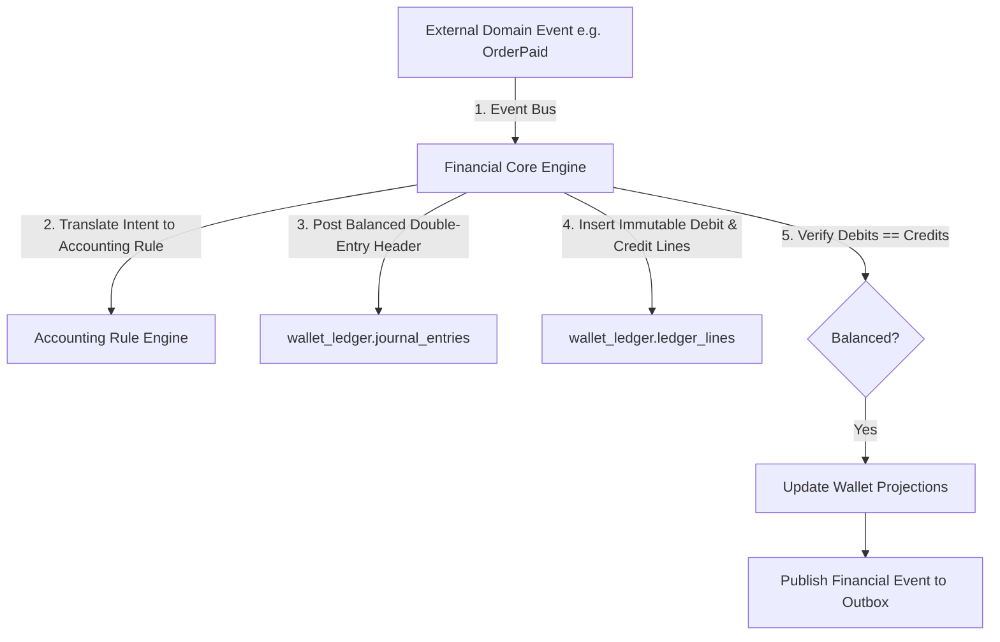

# Winger Backend V2 – Financial Core Master Architecture Specification

This document defines the Financial Core, the single source of truth for all monetary operations across Winger Backend V2.

---

## 1. Architectural Law: FINANCIAL ISOLATION

### Core Principles
1. **Single Source of Truth**: All monetary operations pass exclusively through the Financial Core via the Transaction Orchestrator (`wallet_ledger.fn_execute_transaction_orchestrator`).
2. **Accounting Principles**: Designed using double-entry accounting principles rather than wallet-first mutability.
3. **No Direct Mutations**: External domains (Orders, Growth, Checkout) NEVER update wallet balances or ledger tables directly.
