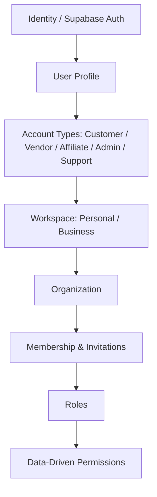

# Winger Backend V2 – Identity & Platform Kernel Foundation Specification

This document details the production-ready **Identity & Access Management (IAM)** pipeline, Workspace Context Service, and **Platform Kernel Services** implemented in **Sprint 2**.

---

## 1. Identity & Access Management Pipeline

The platform enforces a multi-tenant hierarchy connecting global security identities to workspace-scoped execution boundaries:



### Core Components
- **Identity & Profiles**: Managed via `auth.users` with automated profile creation (`public.profiles`) and default `CUSTOMER` role assignment upon signup.
- **Account Types**: `CUSTOMER`, `VENDOR`, `AFFILIATE`, `ADMIN`, `SUPPORT` defined in `enum_user_role`.
- **Workspaces & Organizations**: Multi-tenant boundaries (`public.workspaces`, `public.organizations`).
- **Invitations**: Tokenized workspace member invitation engine (`public.invitations`).
- **Verifications**: Document verification store (`public.verifications`) for KYC, Phone, Email, Business, Vendor, and Affiliate onboarding.

---

## 2. Platform Kernel Infrastructure Services

### 2.1 Workspace Context Service
- **Stored Procedure**: `fn_resolve_workspace_context(p_requested_workspace_id)`
  - Resolves identity membership, active workspace ID, workspace role, and aggregates effective permission keys.
- **Edge Function**: `/workspace-context` (Resolves context & handles active workspace switching).

### 2.2 Authorization Service
- **Stored Procedures**:
  - `fn_has_permission(p_permission_key, p_workspace_id)`: Evaluates dynamic permissions.
  - `fn_get_effective_permissions(p_workspace_id)`: Returns array of granted permissions.

### 2.3 Configuration Service
- **Table**: `public.configurations`
- Provides workspace-scoped and global runtime settings (`is_public`, `workspace_id`, `key`, `value`).

### 2.4 Transactional Event Outbox (Event Bus)
- **Table**: `audit_system.outbox`
- **Helper Procedure**: `fn_publish_domain_event(p_event_type, p_aggregate_type, p_aggregate_id, p_payload, p_workspace_id)`
- Ensures atomic event publishing within the same database transaction.

### 2.5 Unified Notification Gateway
- **Tables**: `public.notification_templates`, `public.notifications`
- Supports In-App, Push (FCM), Email (SendGrid), and SMS channels.

---

## 3. Storage Architecture & Security Policies

The storage architecture is configured with 3 dedicated buckets guarded by Row Level Security:

1. **`avatars`** (Public Read, Owner Upload): User profile pictures.
2. **`vendor-logos`** (Public Read, Vendor Upload): Vendor store logos and promotional banners.
3. **`verification-documents`** (Private, Owner Read/Upload, Admin Audit): Confidential identity, KYC, and business documentation.

---

## 4. Verification & Testing

Run `pgTAP` automated database test suites:

```bash
# Execute Sprint 2 IAM & Kernel tests
supabase test db
```

- [x] `05_identity_and_workspace_test.sql`
- [x] `06_kernel_services_test.sql`
