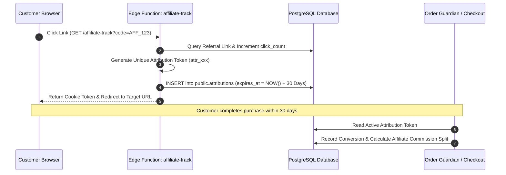

# Winger Backend V2 – Marketplace Catalog & Affiliate Attribution Engine Specification

This document defines the schema architecture, store onboarding lifecycles, and 30-day cookie referral attribution rules implemented in **Sprint 2**.

---

## 1. Multi-Tenant Workspace Catalog Architecture

All marketplace resources (vendors, categories, products, product variants, shopping carts) are explicitly scoped to a `workspace_id` to enforce multi-tenant isolation across store brands.

### Entity Overview
- **`public.workspaces`**: Multi-tenant isolation boundary.
- **`public.vendors`**: Store profile (`store_name`, `store_slug`, `verification_status`).
- **`public.products`**: Product listings (`base_price`, `currency`, `status`: `DRAFT` / `ACTIVE` / `OUT_OF_STOCK` / `ARCHIVED`).
- **`public.product_variants`**: SKU variants managing specific stock quantities (`stock_quantity`, `price`, `version`).
- **`public.carts` & `public.cart_items`**: Customer shopping carts with price snapshotting at insertion time.

---

## 2. 30-Day Affiliate Attribution Model

Winger features a 30-day cookie-based attribution engine connecting customer purchases back to promoting affiliates.

### Attribution Workflow

### Attribution Rules
1. **Attribution Window**: 30 days (`expires_at = NOW() + INTERVAL '30 days'`).
2. **Last-Touch Model**: If a customer clicks multiple affiliate links, the most recent verified attribution token is assigned to the purchase.
3. **Idempotency**: Conversions stamp `converted_at` timestamp to prevent duplicate commission claims on a single attribution record.

---

## 3. Row Level Security Policy Matrix

| Table | Role: `anon` | Role: `authenticated` (Customer) | Role: `authenticated` (Vendor) |
| :--- | :--- | :--- | :--- |
| `categories` | SELECT (`deleted_at IS NULL`) | SELECT | SELECT / ALL (Admin) |
| `vendors` | SELECT (`deleted_at IS NULL`) | SELECT | UPDATE (Own store) |
| `products` | SELECT (`status = 'ACTIVE'`) | SELECT (`status = 'ACTIVE'`) | ALL (Own products) |
| `product_variants` | SELECT (`deleted_at IS NULL`) | SELECT | ALL (Own product SKUs) |
| `carts` | No Access | ALL (Own cart) | ALL (Own cart) |
| `affiliate_links` | No Access | SELECT | ALL (Own links) |

---

## 4. Verification Checklist

- [x] Multi-tenant workspace and organization schemas created.
- [x] Product catalog, variants, and stock quantity tracking implemented.
- [x] Cart manager Edge Function with unit price snapshotting created.
- [x] 30-day affiliate attribution engine and `affiliate-track` Edge Function implemented.
- [x] pgTAP test suites (`03_marketplace_catalog_test.sql`, `04_affiliate_attribution_test.sql`) created.
