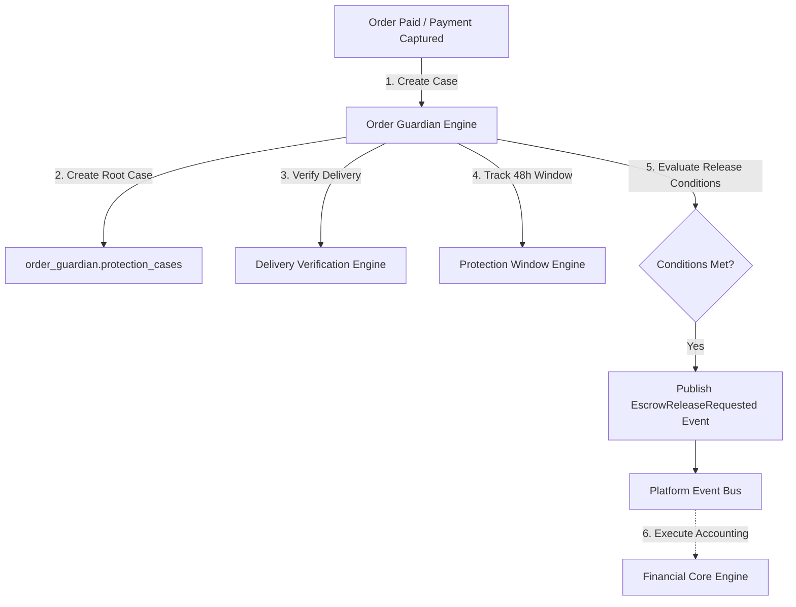

# Winger Backend V2 – Order Guardian Architecture Specification

This document defines Winger's Trust & Protection Platform implemented in **Sprint 8**.

---

## 1. Architectural Law: TRUST IS SEPARATE FROM MONEY

### Core Principles
1. **Trust Engine Responsibility**: Coordinates delivery verifications, 48h protection windows, dispute cases, evidence file stores, and SLA tracking.
2. **Zero Money Ownership**: Order Guardian NEVER mutates wallet balances, ledger entries, or escrow holdings directly.
3. **Event-Driven Financial Execution**: When release conditions pass, Order Guardian publishes `order_guardian.escrow.release_requested` to the Platform Event Bus (`audit_system.outbox`).
