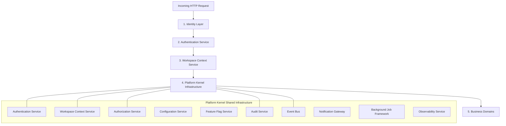
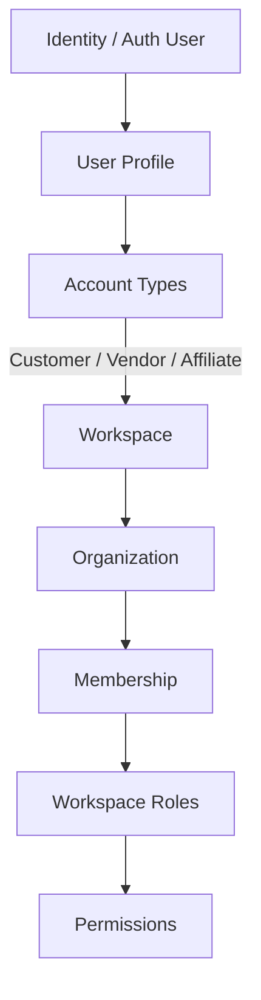
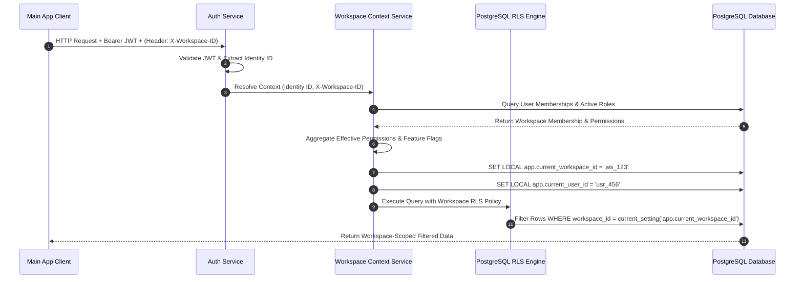
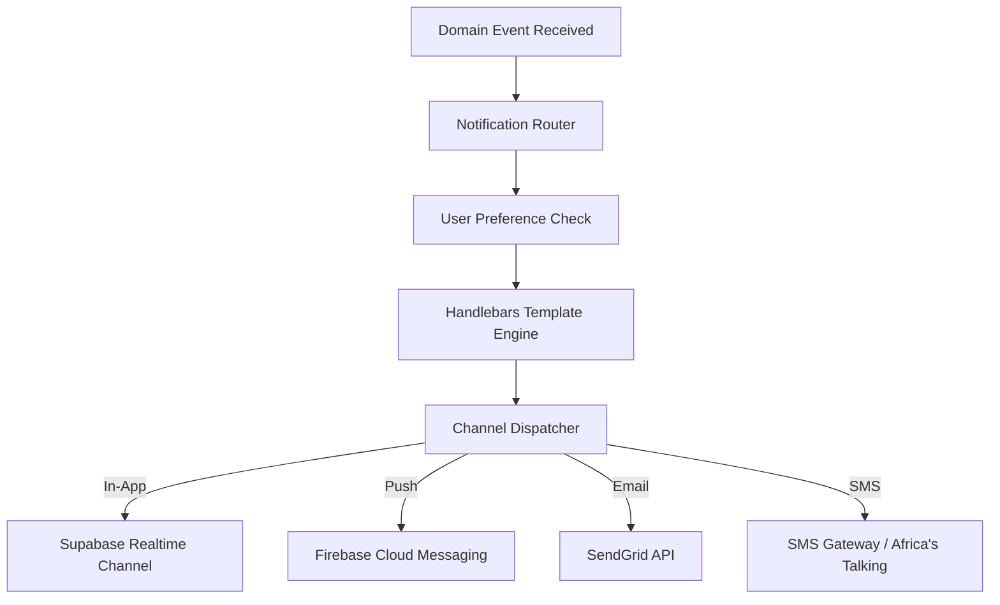
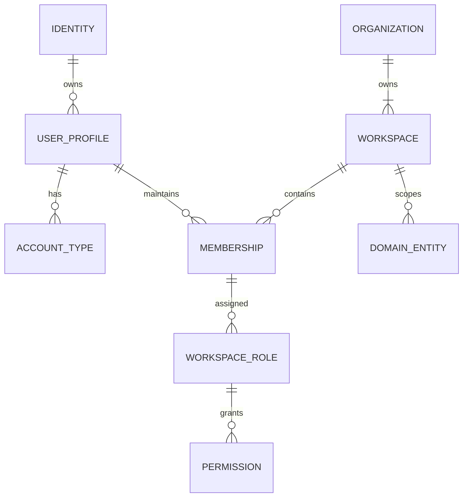
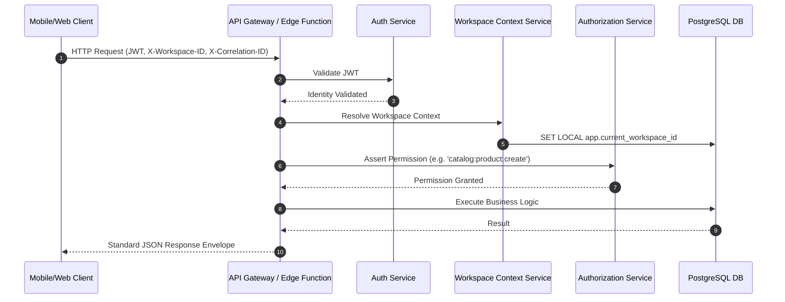
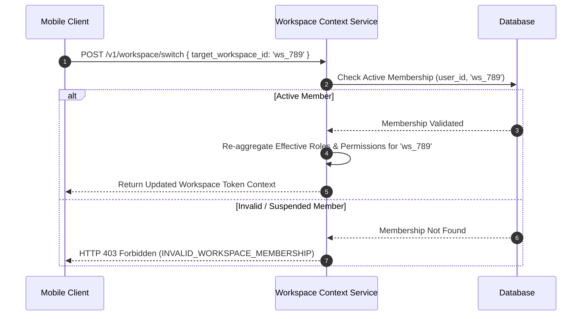

# Winger Backend V2 – Platform Kernel & Core Platform Services Specification

**Document Title**: Winger Master Platform Blueprint & Kernel Architecture  
**Document Version**: 3.0.0  
**Status**: Single Source of Truth / Approved Blueprint  
**Author**: Principal Software Architect & Core Engineering Leadership  
**Date**: August 2026  

---

## Executive Summary

This specification establishes the **Platform Kernel & Core Platform Services Architecture** for **Winger Backend V2**. It replaces all previous architecture drafts and serves as the single source of truth for the platform.

Winger is designed as a production-grade, highly scalable, multi-tenant marketplace platform capable of processing millions of daily transactions across Customers, Vendors, Affiliates, and Administrators.

To achieve long-term maintainability and high security, Winger enforces strict separation between shared infrastructure (**Platform Kernel**) and domain-specific logic (**Business Domains**). Business modules MUST NEVER re-implement authentication, authorization, workspace resolution, event publishing, auditing, configuration management, or notification handling.

---

## 1. Core Architecture Pipeline

The entire system operates on a linear, deterministic pipeline for every incoming request:



### Architectural Principles

1. **Pipeline Ordering**: Every API request must pass through Authentication and Workspace Context resolution before reaching business domain handlers.
2. **Kernel Isolation**: Business domains rely on the Kernel for all infrastructure capabilities via a unified **Shared Platform SDK**.
3. **No Domain Leakage**: Business domains cannot bypass the Kernel to query identity tables or issue un-audited state mutations.

---

## 2. Identity & Multi-Tenant Workspace Model

Winger implements a flexible, hierarchical identity model allowing a single user to maintain multiple account types across multiple workspaces and organizations.



### Hierarchy Definitions

- **Identity**: The global security principal (managed by Supabase Auth / GoTrue) representing a unique human user with a single set of credentials.
- **User Profile**: The global person entity storing name, email, avatar, and default preferences.
- **Account Types**: Functional capabilities enabled for a profile (e.g., a user can simultaneously be a Customer, a Store Vendor, and an Affiliate Marketer).
- **Workspace**: The fundamental multi-tenant boundary. All products, orders, catalogs, and financial balances belong to a specific Workspace.
- **Organization**: A legal business entity that owns one or more Workspaces (e.g., an enterprise vendor managing multiple regional storefront workspaces).
- **Membership**: Junction linking an Identity to a specific Workspace or Organization with active state metadata.
- **Roles**: Workspace-scoped collections of permissions (e.g., `WORKSPACE_OWNER`, `STORE_MANAGER`, `FINANCE_CLERK`).
- **Permissions**: Fine-grained, data-driven security capabilities (e.g., `catalog:product:create`, `escrow:release`, `payout:request`).

---

## 3. Platform Kernel Services Specification

The Platform Kernel consists of 13 dedicated core services.

### 3.1 Authentication Service
- **Purpose**: Verifies identity credentials and issues secure, signed JWT access tokens.
- **Responsibilities**: User login, OAuth integration, multi-factor authentication (MFA), password reset, token validation, and session lifecycle.
- **Dependencies**: Supabase Auth (GoTrue), Audit Service.
- **Public Interface**:
  ```typescript
  interface AuthenticationService {
    validateToken(jwt: string): Promise<AuthenticatedIdentity>;
    refreshToken(refreshToken: string): Promise<SessionTokenPair>;
    revokeSession(sessionId: string): Promise<void>;
  }
  ```
- **Future Scalability**: Supports passkeys (WebAuthn) and federated enterprise SSO (SAML/OIDC).

### 3.2 Workspace Context Service
- **Purpose**: Resolves, validates, and injects the active workspace context into the execution request.
- **Responsibilities**: Workspace switching, membership verification, workspace feature flag resolution, and PostgreSQL session context injection (`SET LOCAL app.current_workspace_id = ...`).
- **Dependencies**: Authentication Service, Authorization Service.
- **Public Interface**:
  ```typescript
  interface WorkspaceContextService {
    resolveContext(identityId: string, requestedWorkspaceId?: string): Promise<WorkspaceContext>;
    switchWorkspace(identityId: string, targetWorkspaceId: string): Promise<WorkspaceContext>;
  }
  ```
- **Future Scalability**: Cached via Redis / Memory LRU to guarantee sub-millisecond context resolution.

### 3.3 Authorization Service
- **Purpose**: Evaluates fine-grained permissions against active workspace context.
- **Responsibilities**: Role aggregation, permission check evaluation, ABAC policy enforcement, and Row Level Security (RLS) claim formatting.
- **Dependencies**: Workspace Context Service.
- **Public Interface**:
  ```typescript
  interface AuthorizationService {
    hasPermission(context: WorkspaceContext, permissionKey: string): Promise<boolean>;
    assertPermission(context: WorkspaceContext, permissionKey: string): Promise<void>;
    getEffectivePermissions(context: WorkspaceContext): Promise<string[]>;
  }
  ```
- **Future Scalability**: Compiles role permissions into bitmask integer arrays for microsecond evaluation.

### 3.4 Configuration Service
- **Purpose**: Provides centralized, hierarchical runtime parameters across the platform.
- **Responsibilities**: Manage global defaults, regional settings, financial thresholds (platform fees, escrow holding periods, withdrawal limits), and workspace overrides.
- **Dependencies**: Audit Service.
- **Public Interface**:
  ```typescript
  interface ConfigurationService {
    get<T>(key: string, workspaceId?: string): Promise<T>;
    set<T>(key: string, value: T, actorId: string, workspaceId?: string): Promise<void>;
  }
  ```
- **Future Scalability**: In-memory cache with PostgreSQL LISTEN/NOTIFY for instantaneous parameter propagation.

### 3.5 Feature Flag Service
- **Purpose**: Manages dynamic feature gating, gradual percentage rollouts, and targeted feature delivery.
- **Responsibilities**: Global flags, workspace-scoped flags, user-targeted flags, percentage-based rollout hashing.
- **Dependencies**: Configuration Service, Workspace Context Service.
- **Public Interface**:
  ```typescript
  interface FeatureFlagService {
    isEnabled(flagKey: string, context: WorkspaceContext): Promise<boolean>;
    getVariant(flagKey: string, context: WorkspaceContext): Promise<string>;
  }
  ```
- **Future Scalability**: Deterministic Murmur3 hashing on user/workspace IDs for zero-latency local evaluation.

### 3.6 Audit Service
- **Purpose**: Captures immutable, legally compliant records of all system state modifications and administrative actions.
- **Responsibilities**: Log JSON diffs (`OLD` vs `NEW`), record actor ID, client IP, correlation ID, and target entity details.
- **Dependencies**: Observability Service.
- **Public Interface**:
  ```typescript
  interface AuditService {
    log(event: AuditLogPayload): Promise<void>;
    query(filter: AuditQueryFilter): Promise<AuditLogRecord[]>;
  }
  ```
- **Future Scalability**: Writes to append-only database tables, asynchronously archived to cold object storage (S3/GCS Parquet).

### 3.7 Event Bus
- **Purpose**: Powers asynchronous, event-driven communication between decoupled platform modules.
- **Responsibilities**: Transactional Outbox pattern enforcement, event publishing, subscriber dispatch, idempotency checking, dead-letter queue routing.
- **Dependencies**: Audit Service, Observability Service.
- **Public Interface**:
  ```typescript
  interface EventBus {
    publish<T>(topic: string, payload: T, metadata: EventMetadata): Promise<void>;
    subscribe<T>(topic: string, handler: EventHandler<T>): void;
  }
  ```
- **Future Scalability**: Seamlessly upgrades from Postgres Outbox to Apache Kafka / AWS EventBridge under extreme volume.

### 3.8 Notification Gateway
- **Purpose**: Unified multi-channel messaging service.
- **Responsibilities**: Template rendering, channel routing (In-App, FCM Push, SendGrid Email, SMS), preference checking, rate limiting.
- **Dependencies**: Event Bus, Configuration Service.
- **Public Interface**:
  ```typescript
  interface NotificationGateway {
    send(notification: NotificationRequest): Promise<NotificationResult>;
    sendBatch(notifications: NotificationRequest[]): Promise<NotificationBatchResult>;
  }
  ```
- **Future Scalability**: Async queue processing via worker pools with fallback provider routing.

### 3.9 Background Job Framework
- **Purpose**: Manages asynchronous, reliable background task execution.
- **Responsibilities**: Cron scheduling (`pg_cron`), job queuing, automatic exponential backoff retries, concurrency locking, job status tracking.
- **Dependencies**: Event Bus, Observability Service.
- **Public Interface**:
  ```typescript
  interface BackgroundJobFramework {
    enqueue(jobName: string, payload: unknown, options?: JobOptions): Promise<string>;
    scheduleCron(jobName: string, cronSchedule: string, payload: unknown): Promise<void>;
  }
  ```
- **Future Scalability**: Distributed queue workers using Redis / Postgres advisory locks.

### 3.10 Observability Service
- **Purpose**: Provides centralized metrics, structured logging, distributed tracing, and alerting.
- **Responsibilities**: Inject correlation IDs (`x-correlation-id`), collect performance metrics, format JSON logs, report runtime exceptions.
- **Dependencies**: None (Foundation layer).
- **Public Interface**:
  ```typescript
  interface ObservabilityService {
    log(level: 'INFO' | 'WARN' | 'ERROR', message: string, context?: Record<string, unknown>): void;
    recordMetric(metricName: string, value: number, tags?: Record<string, string>): void;
    captureException(error: Error, context?: Record<string, unknown>): void;
  }
  ```
- **Future Scalability**: Exports OpenTelemetry traces and Prometheus metrics to Grafana/Datadog.

### 3.11 Shared Platform SDK
- **Purpose**: Standardized client wrapper used by Edge Functions and business modules to interact with Kernel services.
- **Responsibilities**: Provide type-safe utilities, database connection pooling setup, CORS formatting, standardized HTTP responses.
- **Dependencies**: All Kernel Services.

### 3.12 API Standards Service
- **Purpose**: Enforces platform-wide consistency for HTTP endpoints, request validation, error formatting, and pagination.
- **Responsibilities**: Request envelope validation, Zod schema checks, RFC-7807 error building, cursor pagination generation.
- **Dependencies**: Observability Service.

### 3.13 Security Services
- **Purpose**: Enforces platform-wide cryptography, secret access, rate limiting, and threat detection.
- **Responsibilities**: HMAC-SHA256 signature verification, Supabase Vault secret retrieval, sliding-window rate limiting, IP velocity tracking.
- **Dependencies**: Configuration Service, Audit Service.

---

## 4. Workspace Context Lifecycle & RLS Integration



### Detailed Lifecycle Steps

1. **Request Reception**: Request arrives containing Authorization Bearer JWT and optional `X-Workspace-ID` header.
2. **Identity Verification**: Authentication Service validates JWT signature and extracts `identity_id`.
3. **Workspace Resolution**:
   - If `X-Workspace-ID` header is present, Workspace Context Service verifies user has an active `Membership` in that workspace.
   - If missing, service resolves user's default/primary Workspace ID.
4. **Permission Aggregation**: Service fetches roles assigned to the user within that specific workspace, compiling the list of effective permissions.
5. **Database Session Injection**: Prior to executing queries, the service sets PostgreSQL session variables:
   ```sql
   SET LOCAL app.current_workspace_id = '018f2d5e-7a1b-7000-8000-123456789abc';
   SET LOCAL app.current_user_id = '018f2d5e-9999-7000-8000-987654321xyz';
   ```
6. **RLS Policy Enforcement**: Database executes table RLS policies:
   ```sql
   CREATE POLICY workspace_isolation_policy ON public.products
       FOR ALL TO authenticated
       USING (workspace_id = (current_setting('app.current_workspace_id'))::UUID);
   ```

---

## 5. Event-Driven Architecture & Domain Events

### 5.1 Event Specification Standards
- **Naming Standard**: `<domain>.<entity>.<past_tense_verb>` (e.g. `order_guardian.escrow.released`, `checkout.payment.verified`).
- **Schema Payload Envelope**:
  ```json
  {
    "event_id": "018f2d5e-7a1b-7000-8000-123456789abc",
    "event_type": "order_guardian.escrow.released",
    "version": "1.0.0",
    "timestamp": "2026-08-06T02:39:48Z",
    "correlation_id": "corr_018f2d5e-9999",
    "producer": "order-guardian-service",
    "workspace_id": "018f2d5e-1111-7000-8000-123456789abc",
    "data": {
      "order_id": "018f2d5e-2222",
      "escrow_amount": 50000,
      "currency": "TZS",
      "vendor_payout": 42500,
      "affiliate_payout": 5000,
      "platform_fee": 2500
    }
  }
  ```

### 5.2 Transactional Outbox Pattern
To prevent dual-write bugs (where DB update succeeds but event emission fails), events are written to an `audit_system.outbox` table inside the same database transaction. A `pg_cron` worker reads un-published outbox entries and publishes them to subscribers.

### 5.3 Core Platform Events Reference

| Event Name | Producer Domain | Triggering Condition | Primary Consumers |
| :--- | :--- | :--- | :--- |
| `identity.user.registered` | Auth Service | New user completes registration | Notification Gateway, Workspace Service |
| `workspace.member.invited` | Workspace Context | Member invited to workspace | Notification Gateway (Email) |
| `checkout.payment.verified` | Checkout Service | Selcom webhook HMAC verified | Order Guardian (Lock Escrow) |
| `order_guardian.order.created` | Order Guardian | New order placed by customer | Inventory Manager, Notification Gateway |
| `order_guardian.escrow.locked` | Order Guardian | Escrow account funded | Vendor Dashboard, Realtime Gateway |
| `order_guardian.escrow.released` | Order Guardian | Delivery confirmed or timer expired | Wallet Ledger (Double-Entry Split) |
| `wallet.payout.requested` | Wallet Ledger | Vendor requests balance payout | Support Dashboard, Finance Manager |

---

## 6. Centralized Runtime Configuration

Configuration is managed hierarchically. Lower-level overrides take precedence over higher-level defaults:  
`System Defaults` $\rightarrow$ `Regional Defaults` $\rightarrow$ `Organization Overrides` $\rightarrow$ `Workspace Overrides`.

```json
{
  "financial": {
    "platform_fee_percentage": 5.0,
    "default_escrow_hold_days": 7,
    "max_daily_withdrawal_tzs": 10000000,
    "min_payout_amount_tzs": 10000
  },
  "operational": {
    "maintenance_mode": false,
    "allowed_currencies": ["TZS", "KES", "UGX", "USD"],
    "default_language": "en"
  }
}
```

---

## 7. Feature Flag System

Supports 4 targeting strategies:
1. **Global Flags**: Kill switches for platform features.
2. **Workspace Flags**: Beta features enabled for specific vendor stores.
3. **User Flags**: Internal testing flags enabled for employee user IDs.
4. **Percentage Rollouts**: Gradual feature release using deterministic hashing:
   $$\text{Hash}(\text{workspace\_id} + \text{flag\_key}) \pmod{100} < \text{target\_percentage}$$

---

## 8. Unified Notification Gateway Architecture



---

## 9. Audit & Observability Architecture

- **Correlation ID Propagation**: Every request receives an `x-correlation-id` header (generated if missing), passed through all Edge Functions, database queries, and emitted events.
- **Structured JSON Logging**: All logs emitted as single-line JSON objects with `timestamp`, `level`, `correlation_id`, `workspace_id`, and `event`.
- **Metrics**: Track API latency (P95/P99), database pool exhaustion, escrow lock duration, and webhook failure counts.

---

## 10. Background Job Framework Architecture

- **Cron Scheduling**: `pg_cron` schedules recurring maintenance tasks.
- **Asynchronous Execution Queue**: Edge Functions act as workers consuming tasks from `audit_system.job_queue`.
- **Core Jobs**:
  - `job_escrow_auto_release`: Sweeps confirmed orders exceeding hold duration.
  - `job_payout_batch_processor`: Batches approved vendor payout requests.
  - `job_webhook_retry_worker`: Retries failed Selcom payment notifications.
  - `job_analytics_aggregator`: Compiles daily store revenue reports.

---

## 11. High-Level Conceptual Data Model (No SQL)



### Key Conceptual Entities
- **Identity**: Security principal.
- **UserProfile**: Personal information.
- **Organization**: Parent business entity.
- **Workspace**: Isolated multi-tenant boundary.
- **Membership**: User-to-Workspace association.
- **WorkspaceRole**: Named collection of permissions scoped to a workspace.
- **Permission**: Granular action key (`resource:action`).
- **DomainEntity**: Any business object (product, order, escrow) tied to a `workspace_id`.

---

## 12. Complete Core Lifecycle Diagrams

### 12.1 Request Lifecycle


### 12.2 Workspace Switching Lifecycle


---

## 13. Future Scaling Strategy

1. **Database Sharding by Workspace ID**: Because 100% of domain data contains `workspace_id`, the database can be horizontally sharded across multiple PostgreSQL instances using Vitess or Citus Data without requiring cross-shard joins.
2. **Distributed Outbox Processing**: Upgrade internal outbox queues to Apache Kafka or AWS Kinesis when event volume exceeds 50,000 events/second.
3. **Global Edge Gateway Caching**: Deploy Workspace Context resolution logic to Cloudflare Workers / Vercel Edge for microsecond context resolution near users.

---

**[END OF MASTER PLATFORM KERNEL SPECIFICATION]**
