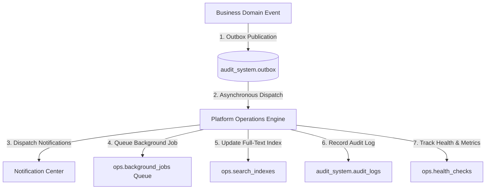

# Winger Backend V2 – Platform Operations & Production Readiness Specification

This document defines the Platform Operations infrastructure layer implemented in **Sprint 9**.

---

## 1. System Architecture & Event Subscription

### Core Principles
1. **Infrastructure Isolation**: Platform Operations is shared infrastructure. It contains **ZERO** domain business logic.
2. **Event-Driven Integration**: All operational tasks (Notifications, Background Jobs, Search Indexing, Audit Logging, Analytics) subscribe to domain events published via `audit_system.outbox`.
3. **Production Readiness**: Equips the backend with job retry policies, Dead-Letter Queues (DLQ), sliding-window rate limiting, percentage feature flag rollouts, and health monitoring endpoints.
