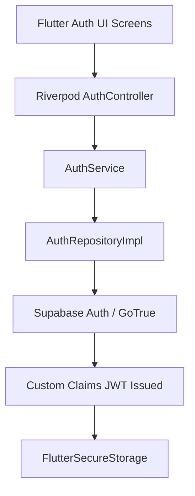

# Winger Authentication Architecture Specification

**Document Title**: Sprint B Authentication & Identity Lifecycle Specification  
**Version**: 1.0.0  
**Target Backend**: Winger Backend V2 (Supabase Auth / GoTrue)  
**Author**: Principal Flutter Architect  

---

## 1. Overview & Architecture Pipeline

Authentication in the Winger Main App uses the **Supabase Flutter SDK** integrated with **Winger Backend V2**.

### Layer Responsibilities

- **`AuthService`**: High-level application auth coordinator managing session restoration, password resets, and state machine broadcasts.
- **`AuthRepository`**: Abstraction layer interfacing directly with `Supabase.instance.client.auth`.
- **`FlutterSecureStorage`**: Hardware-encrypted local token and session persistence.

---

## 2. Auth State Machine

Authentication state is represented using an explicit sealed class model (`AuthState`):

- **`Unauthenticated`**: Default state when no valid user session exists.
- **`Authenticating`**: Transient state while performing login, registration, or session restoration.
- **`Authenticated(user, identityContext)`**: Session is verified and identity context is hydrated.
- **`SessionRefreshing`**: Background refresh of expired JWT access tokens.
- **`SessionExpired`**: Token refresh failed or session invalidated by server.
- **`RegistrationPendingVerification`**: User created account; email confirmation is pending.
- **`PasswordResetRequired`**: Password reset token validated; awaiting new password entry.
- **`AuthenticationFailure(failure)`**: Authentication error occurred (e.g. invalid credentials, network error).

---

## 3. Supported Authentication Operations

1. **Email/Password Registration**: `signUpWithEmail(email, password, metadata)`
2. **Email/Password Login**: `signInWithEmail(email, password)`
3. **Session Restoration**: `restoreSession()` via PKCE auto-refresh
4. **Password Reset**: `sendPasswordResetEmail(email)` & `updatePassword(newPassword)`
5. **Email Verification**: `resendVerificationEmail(email)`
6. **Logout**: `signOut()` (Purges auth tokens, workspace context, and client caches)
