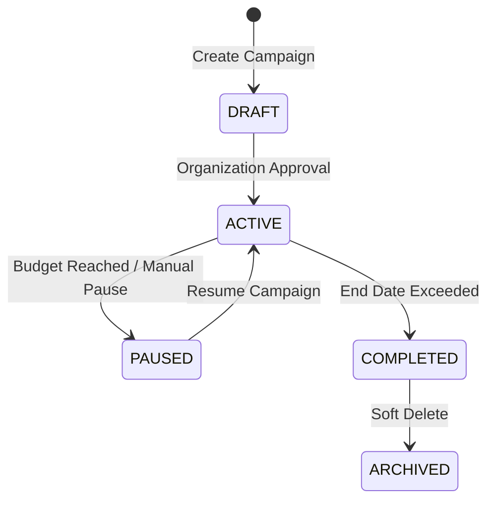

# Winger Backend V2 – Campaigns Specification

Campaigns are first-class entities owned by **Organizations** and managed within workspaces.

---

## 1. Campaign Structure
- **Entity**: `growth.campaigns`
- **Ownership**: Belongs to an `organization_id`.
- **Properties**: `name`, `description`, `status` (`DRAFT`, `ACTIVE`, `PAUSED`, `COMPLETED`, `ARCHIVED`), `start_date`, `end_date`, `budget`, `target_product_ids`, `target_category_ids`, `default_commission_rate`, `visibility`.

---

## 2. Campaign Lifecycle

