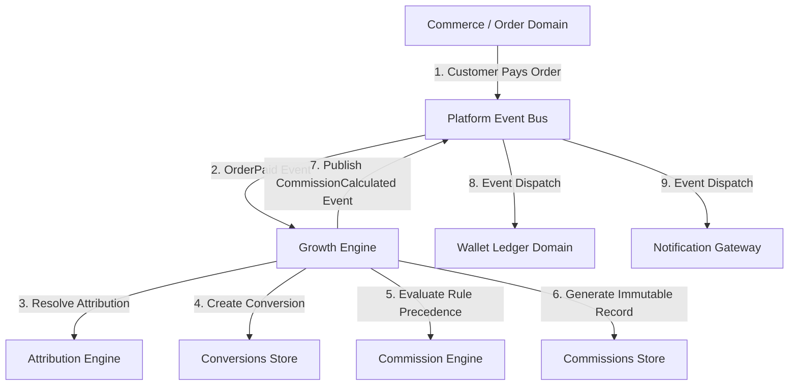

# Winger Backend V2 – Growth Engine Master Architecture Specification

This document defines the architecture, domain decoupling rules, and component specifications for the **Growth Engine (Affiliate Platform)** implemented in **Sprint 4**.

---

## 1. Domain Decoupling Architectural Law

### Architectural Principles
1. **Zero Direct Dependency**: The Commerce/Orders domain contains **ZERO** affiliate tracking parameters, commission calculation logic, or campaign rules.
2. **Event-Driven Communication**: All communication between Orders and Growth occurs asynchronously via the **Platform Event Bus** (`audit_system.outbox`).
3. **Decoupled Evelopment**: The Growth domain or Orders domain can be rewritten or scaled independently without modifying the other.

---

## 2. Growth Domain Subsystems

- **`docs/growth/CAMPAIGNS.md`**: Marketing campaign entity specs & organization ownership.
- **`docs/growth/ATTRIBUTION.md`**: Multi-model attribution engine (`LAST_CLICK`, `FIRST_CLICK`, `TIME_DECAY`).
- **`docs/growth/COMMISSIONS.md`**: Rule evaluation precedence engine (Campaign > Product > Category > Vendor > Default).
- **`docs/growth/TRACKING.md`**: High-volume click session tracking & privacy-conscious SHA-256 IP hashing.
- **`docs/growth/FRAUD.md`**: Non-blocking fraud detection signals & risk flags.
- **`docs/growth/ANALYTICS.md`**: Daily metrics aggregation engine (`growth.analytics_daily`).
