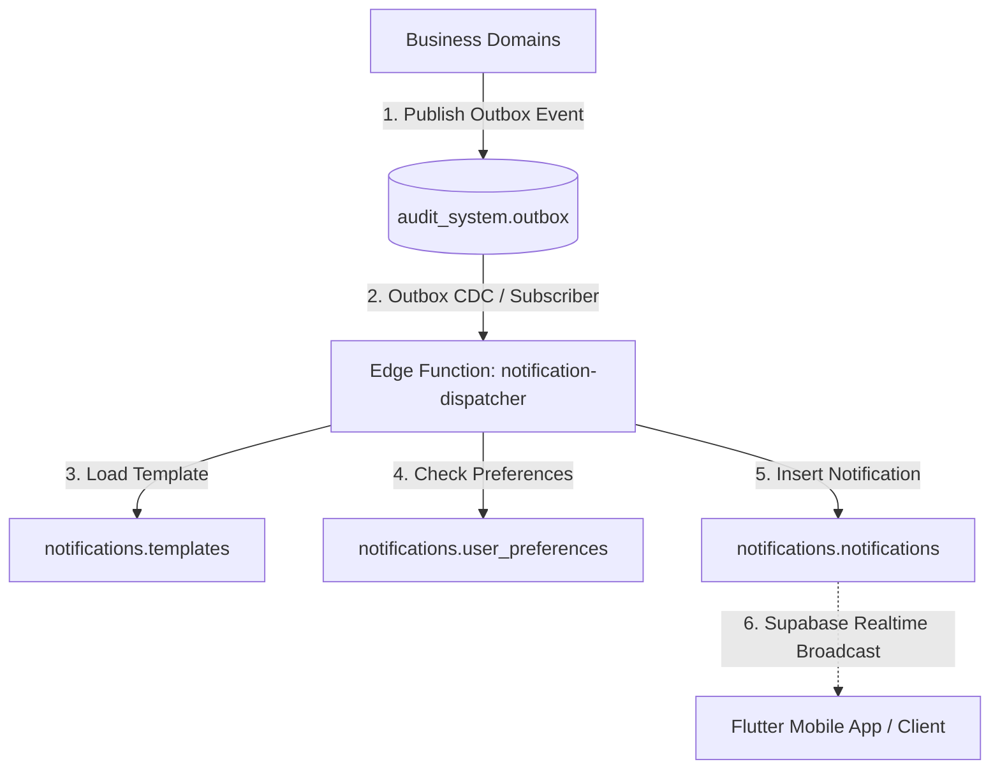

# Winger Backend V2 – Notification Engine & Realtime Event Dispatcher Specification

This document defines the Platform Kernel's shared notification infrastructure.

---

## 1. System Architecture & Event Subscription

### Architectural Principles
1. **Platform Kernel Infrastructure**: Shared notification concerns belong in the Platform Kernel. Business domains NEVER execute push, SMS, or email API calls directly.
2. **Multi-Channel Delivery**: Renders dynamic templates into `IN_APP`, `PUSH`, `EMAIL`, and `SMS`.
3. **Supabase Realtime**: Broadcasts changes on `notifications.notifications` to client apps in realtime over WebSocket connections.
