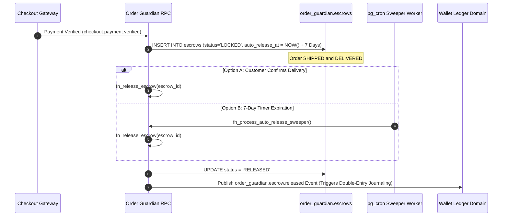

# Winger Backend V2 – Escrow Holding & Release Rules Specification

This document details the escrow locking mechanism, dispute hold rules, and automated release sweeper policies enforced by **Order Guardian**.

---

## 1. Escrow Holding & Release Workflow

---

## 2. Escrow Lockup Breakdown
When funds enter escrow, the total amount is locked into 3 distinct allocation components:
$$\text{Total Escrow Amount} = \text{Vendor Amount} + \text{Affiliate Amount} + \text{Platform Fee}$$

- **Vendor Amount**: Held for merchant payout upon delivery.
- **Affiliate Amount**: Held for promoting affiliate commission payout.
- **Platform Fee**: Retained by Winger marketplace platform.

---

## 3. Dispute Hold Policy
Opening a dispute (`order_guardian.disputes`) freezes the escrow record (`status = 'DISPUTED'`), completely suspending the 7-day auto-release timer until administrative resolution.
