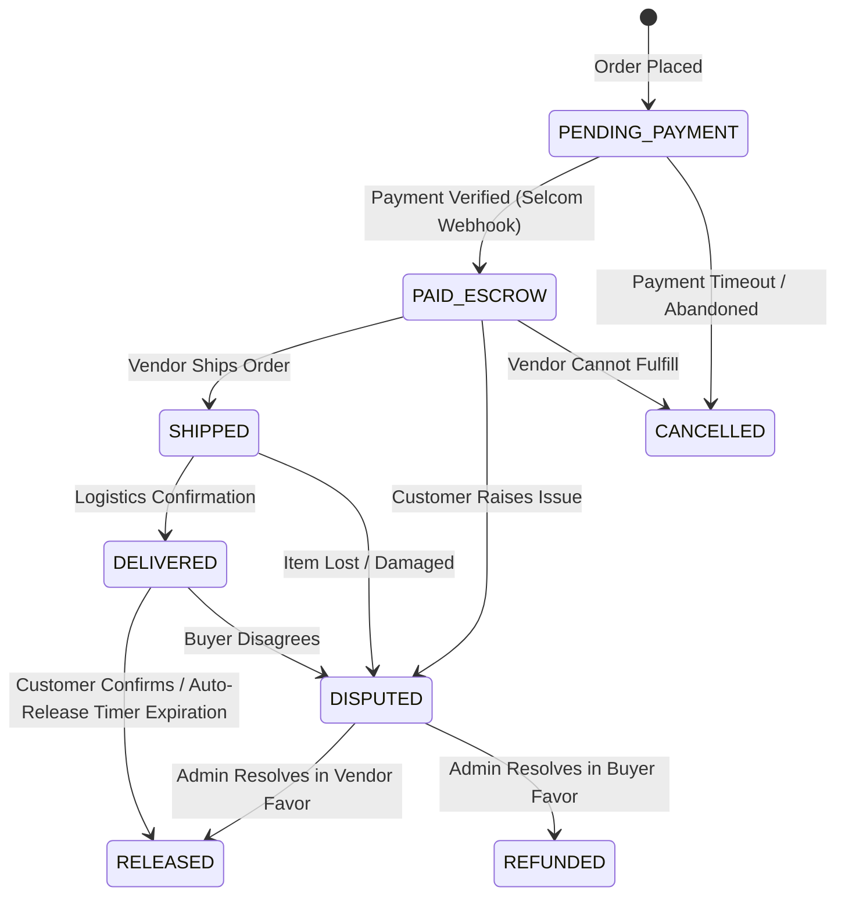

# Winger Backend V2 – Order Guardian State Machine Specification

This document defines the formal order lifecycle state machine, valid transition matrices, and trigger requirements enforced by **Order Guardian**.

---

## 1. Order State Machine Transition Diagram

---

## 2. Valid Transition Matrix

| Current State | Permitted Next States | Authorized Actors |
| :--- | :--- | :--- |
| `PENDING_PAYMENT` | `PAID_ESCROW`, `CANCELLED` | Checkout System, System Timer |
| `PAID_ESCROW` | `SHIPPED`, `DISPUTED`, `CANCELLED` | Vendor, Buyer, Admin |
| `SHIPPED` | `DELIVERED`, `DISPUTED` | Logistics Partner, Buyer, Support |
| `DELIVERED` | `RELEASED`, `DISPUTED` | Buyer, Auto-Release Sweeper (`pg_cron`) |
| `DISPUTED` | `RELEASED`, `REFUNDED` | Support Staff, Admin |
