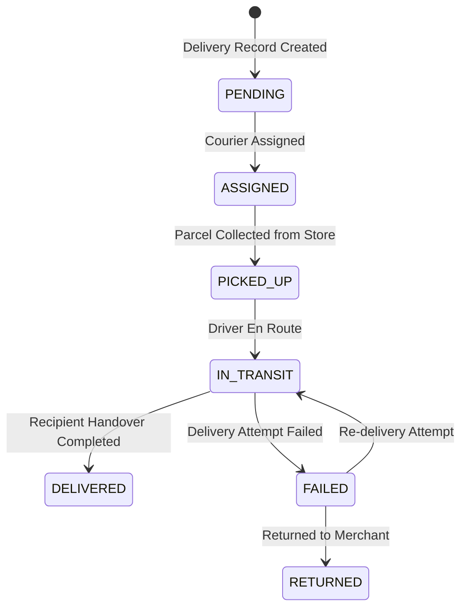

# Winger Backend V2 – Delivery Lifecycle Specification

The delivery subsystem manages courier assignment, transit status updates, and recipient delivery confirmations.

---

## 1. Delivery Lifecycle States

---

## 2. Delivery Status Definitions
- **`PENDING`**: Delivery record initialized.
- **`ASSIGNED`**: Driver/courier assigned.
- **`PICKED_UP`**: Driver collected parcel from vendor store.
- **`IN_TRANSIT`**: Driver en route to customer destination.
- **`DELIVERED`**: Parcel handed to customer.
- **`FAILED`**: Recipient unreachable or address invalid.
- **`RETURNED`**: Parcel returned to merchant inventory.
