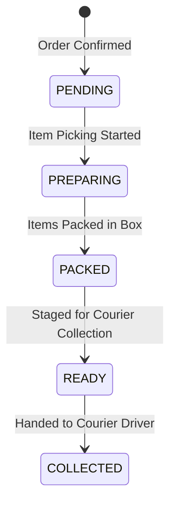

# Winger Backend V2 – Merchant Fulfillment Specification

The fulfillment subsystem manages vendor store preparation, item picking, packing, and dispatch staging independently from courier delivery.

---

## 1. Fulfillment Lifecycle

---

## 2. Fulfillment Statuses
- **`PENDING`**: Order received, awaiting merchant preparation.
- **`PREPARING`**: Merchant picking items from inventory.
- **`PACKED`**: Parcel sealed and labeled.
- **`READY`**: Parcel staged at store pickup area.
- **`COLLECTED`**: Parcel handed to courier driver.
