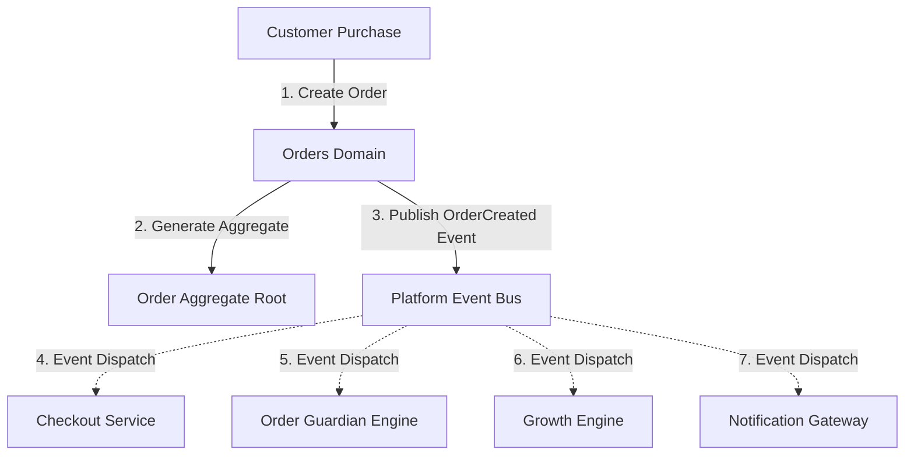

# Winger Backend V2 – Orders Domain Architecture Specification

This document defines the architecture, domain decoupling boundaries, and lifecycle specifications for the **Orders Domain** implemented in **Sprint 5**.

---

## 1. Domain Decoupling Architectural Law

### Architectural Principles
1. **Zero Integration Coupling**: The Orders Domain contains **ZERO** payment gateway APIs, wallet balance updates, commission calculations, affiliate cookie logic, or escrow release rules.
2. **Event-Driven Communication**: State changes publish domain events (`orders.order.created`, `orders.order.paid`, `orders.order.shipped`, `orders.order.delivered`) to `audit_system.outbox`.
3. **Multi-Tenant Workspace Scoping**: Orders are owned by `organizations` and scoped to `workspaces`. RLS guarantees customers can only view their own purchases and vendors can only view orders assigned to their store.
