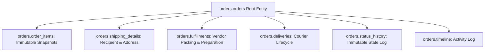

# Winger Backend V2 – Order Aggregate Specification

The Order Aggregate Root (`orders.orders`) encapsulates all entities required to fulfill a customer commerce transaction.

---

## 1. Aggregate Entities & Rationale

### Entity Responsibilities
- **`orders.orders`**: Root entity managing totals, human-readable order number (`WNG-YYYYMMDD-XXXXXX`), and status flags.
- **`orders.order_items`**: Immutable product & price snapshot (`product_name`, `variant_name`, `sku`, `unit_price`, `quantity`). Product catalog edits NEVER mutate past order item snapshots.
- **`orders.shipping_details`**: Delivery address, recipient contact details, and tracking reference.
- **`orders.fulfillments`**: Merchant fulfillment state (`PENDING`, `PREPARING`, `PACKED`, `READY`).
- **`orders.deliveries`**: Courier dispatch lifecycle (`ASSIGNED`, `IN_TRANSIT`, `DELIVERED`).
- **`orders.status_history`**: Immutable log of every status transition with actor profile ID and reason.
- **`orders.timeline`**: Activity timeline log.
