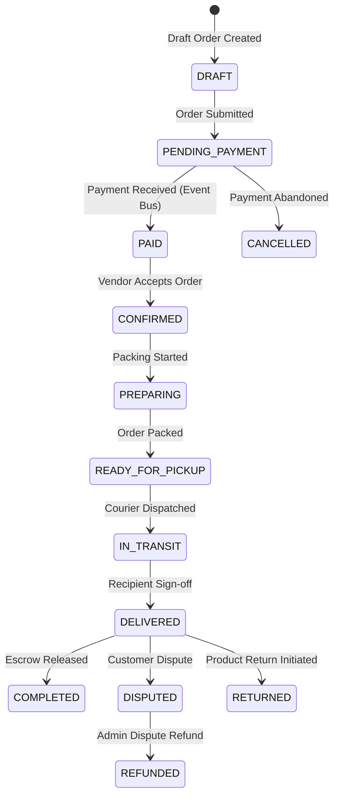

# Winger Backend V2 – Orders State Machine Specification

This document defines the formal order status lifecycle and permitted transition rules.

---

## 1. State Machine Transition Diagram

---

## 2. Valid Transition Matrix

| Current Status | Permitted Next Statuses | Transition Rule RPC |
| :--- | :--- | :--- |
| `DRAFT` | `PENDING_PAYMENT`, `CANCELLED` | `orders.fn_transition_order_status()` |
| `PENDING_PAYMENT` | `PAID`, `CANCELLED` | `orders.fn_transition_order_status()` |
| `PAID` | `CONFIRMED`, `CANCELLED` | `orders.fn_transition_order_status()` |
| `CONFIRMED` | `PREPARING`, `CANCELLED` | `orders.fn_transition_order_status()` |
| `PREPARING` | `READY_FOR_PICKUP`, `CANCELLED` | `orders.fn_transition_order_status()` |
| `READY_FOR_PICKUP` | `IN_TRANSIT`, `CANCELLED` | `orders.fn_transition_order_status()` |
| `IN_TRANSIT` | `DELIVERED`, `DISPUTED` | `orders.fn_transition_order_status()` |
| `DELIVERED` | `COMPLETED`, `RETURNED`, `DISPUTED` | `orders.fn_transition_order_status()` |
| `DISPUTED` | `COMPLETED`, `REFUNDED` | `orders.fn_transition_order_status()` |
