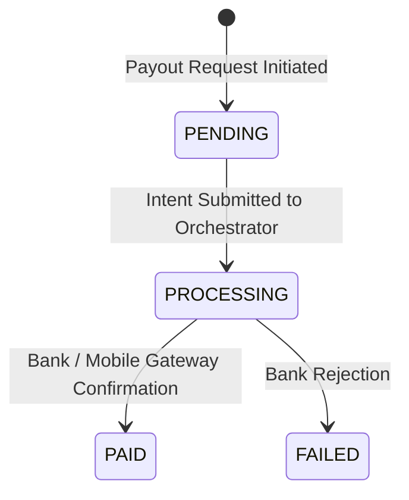

# Winger Backend V2 – Payout Settlement Processor Specification

The Settlement Processor handles batch merchant disbursements and banking payouts.

---

## 1. Settlement Lifecycle

---

## 2. Settlement Execution Standard
All vendor and affiliate payouts MUST submit `INTENT_VENDOR_PAYOUT` to the Transaction Orchestrator to generate `2100_VENDOR_PAYABLE` debits before transmitting funds to external mobile money or banking APIs.
