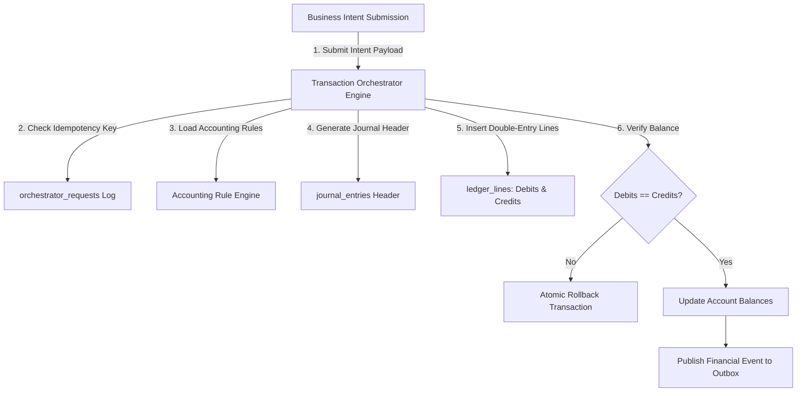

# Winger Backend V2 – Transaction Orchestrator Architecture Specification

This document defines the central execution engine of Winger's Financial Core.

---

## 1. Architectural Law: ALL MONEY FLOWS THROUGH THE TRANSACTION ORCHESTRATOR

### Mandatory Execution Guarantees
1. **Zero Direct Financial Mutations**: No service, API, background worker, or domain may update wallet balances, create ledger lines, or disburse funds directly. Every operation MUST submit a financial intent to `wallet_ledger.fn_execute_transaction_orchestrator(...)`.
2. **Atomic All-or-Nothing Execution**: Executed inside a single `SERIALIZABLE` database transaction. Partial financial updates are strictly impossible.
3. **Double-Entry Balancing Enforcement**: Enforces $\sum \text{Debits} - \sum \text{Credits} = 0$ for every committed transaction header.
